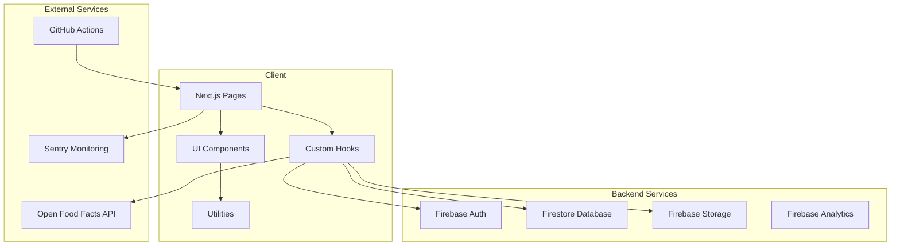
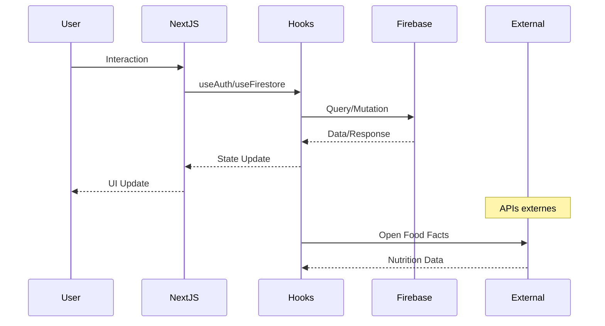
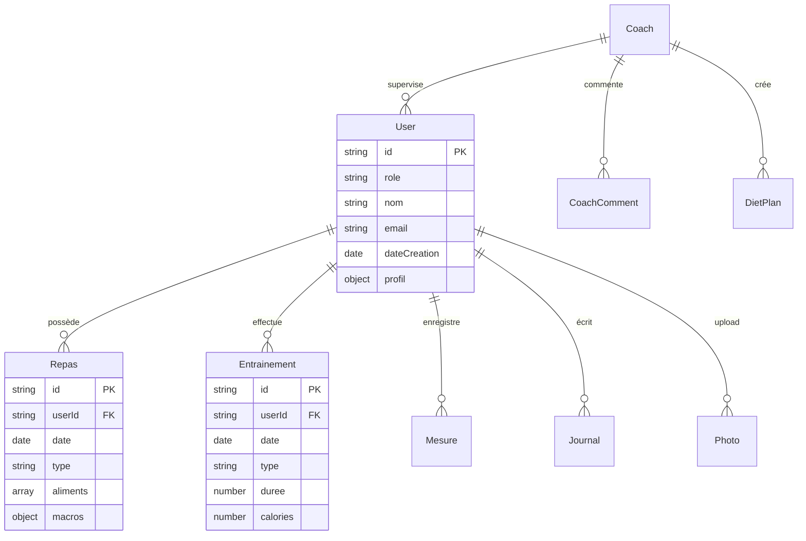

# 🏗️ ARCHITECTURE TECHNIQUE - SuperNovaFit

**Date d'audit** : 14 Janvier 2025  
**Version analysée** : 1.9.4  
**Nombre de fichiers versionnés** : 159  

---

## 📊 Vue d'ensemble

SuperNovaFit est une application web moderne de fitness et nutrition construite avec une architecture full-stack TypeScript. L'application suit une architecture modulaire avec séparation claire des responsabilités entre le frontend (Next.js), le backend (Firebase) et la logique métier.

## 🎯 Architecture Globale



## 🔧 Stack Technique Détaillée

### Frontend
- **Framework** : Next.js 15.1.0 (App Router)
- **UI Library** : React 18.2.0
- **Language** : TypeScript 5.3.3 (strict mode)
- **Styling** : Tailwind CSS 3.4.0 + CSS Modules
- **State Management** : React Hooks + Context
- **Form Handling** : Zod validation
- **Charts** : Recharts 2.10.3
- **Icons** : Heroicons + Lucide React

### Backend & Infrastructure
- **Authentication** : Firebase Auth (Email/Password)
- **Database** : Firestore (NoSQL)
- **Storage** : Firebase Storage (photos, documents)
- **Analytics** : Firebase Analytics + Web Vitals
- **Monitoring** : Sentry
- **Hosting** : Firebase Hosting (SSR)
- **CI/CD** : GitHub Actions

### Outils de développement
- **Testing** : Vitest 3.2.4 + React Testing Library
- **Linting** : ESLint 8.57.1 + TypeScript ESLint
- **Build** : Next.js build + Bundle Analyzer
- **Package Manager** : npm/pnpm

## 📁 Structure des Dossiers

```
SuperNovaFit/
├── src/                        # Code source principal
│   ├── app/                    # Pages Next.js (App Router)
│   │   ├── (auth)/            # Routes protégées
│   │   ├── admin/             # Interface admin
│   │   ├── coach/             # Module coach
│   │   ├── diete/             # Module nutrition
│   │   ├── entrainements/     # Module entraînements
│   │   ├── export/            # Export de données
│   │   ├── journal/           # Journal personnel
│   │   ├── mesures/           # Mesures corporelles
│   │   ├── profil/            # Profil utilisateur
│   │   └── legal/             # Pages légales
│   │
│   ├── components/            # Composants React réutilisables
│   │   ├── analytics/         # Composants analytics
│   │   ├── auth/              # Composants authentification
│   │   ├── charts/            # Graphiques
│   │   ├── layout/            # Layout (Sidebar, Header)
│   │   ├── runtime/           # Gestion erreurs chunks
│   │   └── ui/                # Composants UI génériques
│   │
│   ├── hooks/                 # Custom React Hooks
│   │   ├── useAuth.ts         # Authentification
│   │   ├── useFirestore.ts    # Base de données
│   │   ├── useExportData.ts   # Export données
│   │   └── useInvites.ts      # Invitations coach
│   │
│   ├── lib/                   # Logique métier & utilitaires
│   │   ├── firebase.ts        # Configuration Firebase
│   │   ├── caloriesCalculator.ts # Calculs calories
│   │   ├── userCalculations.ts   # BMR, TDEE, IMC
│   │   ├── garminParser.ts    # Import TCX/GPX
│   │   ├── openfoodfacts.ts   # API nutrition
│   │   └── export/            # Logique export (PDF, Excel)
│   │
│   ├── types/                 # Types TypeScript
│   │   ├── index.ts           # Types principaux
│   │   └── export.ts          # Types export
│   │
│   └── styles/               # Styles globaux
│       └── globals.css       # Tailwind + thème custom
│
├── config/                    # Configuration Firebase
│   ├── firestore.rules       # Règles sécurité
│   ├── firestore.indexes.json # Index Firestore
│   └── storage.rules         # Règles storage
│
├── docs/                      # Documentation complète
│   ├── context/              # Contexte AI & Recovery
│   ├── guides/               # Guides techniques
│   ├── phases/               # Plans de développement
│   ├── fixes/                # Documentation des fixes
│   └── legal/                # Documents légaux
│
├── scripts/                   # Scripts utilitaires
├── public/                    # Assets statiques
└── .github/                   # CI/CD workflows
```

## 🔄 Flux de Données



## 🔐 Architecture de Sécurité

### Couches de sécurité
1. **Authentication Layer** : Firebase Auth avec sessions
2. **Authorization Layer** : Firestore Rules (isOwner, isCoach)
3. **Validation Layer** : Zod schemas côté client
4. **API Security** : Rate limiting (à implémenter)

### Modèle de permissions
```typescript
// Rôles utilisateur
type UserRole = 'sportif' | 'coach' | 'admin';

// Permissions par module
const permissions = {
  sportif: ['read:own', 'write:own'],
  coach: ['read:athletes', 'write:comments', 'write:plans'],
  admin: ['read:all', 'write:all']
};
```

## 📊 Modèle de Données Firestore



## ⚡ Points d'Optimisation Identifiés

### Performance
1. **Bundle Size** : Route `/export` à 388KB (après optimisation)
2. **Images** : Pas de format WebP/AVIF activé
3. **Code Splitting** : Bien implémenté avec dynamic imports

### Architecture
1. **Tests** : Coverage très faible (1.96%)
2. **Error Boundaries** : Uniquement pour chunks, pas global
3. **Monitoring** : Sentry configuré mais DSN exposé

### Scalabilité
1. **Database** : Indexes bien configurés
2. **Pagination** : Implémentée sur toutes les listes
3. **Caching** : Présent pour Open Food Facts API

## 🎯 Recommandations Architecturales

### Court terme (30 jours)
1. **Implémenter Error Boundary global** pour meilleure résilience
2. **Ajouter Rate Limiting** via Firebase Functions
3. **Optimiser images** avec next/image et formats modernes
4. **Augmenter coverage tests** à minimum 30%

### Moyen terme (60 jours)
1. **Implémenter State Management** centralisé (Zustand/Jotai)
2. **Ajouter Service Worker** pour fonctionnalités offline
3. **Optimiser Firestore queries** avec memoization
4. **Implémenter API Gateway** pour services externes

### Long terme (90 jours)
1. **Migration vers Edge Functions** pour performance
2. **Implémenter GraphQL** pour queries optimisées
3. **Ajouter Multi-tenancy** pour scale enterprise
4. **Internationalisation** complète

## 📈 Métriques d'Architecture

| Métrique | Valeur Actuelle | Objectif | Statut |
|----------|----------------|----------|---------|
| Coupling | Faible | Faible | ✅ |
| Cohésion | Élevée | Élevée | ✅ |
| Complexité cyclomatique | Moyenne | Faible | ⚠️ |
| Duplication de code | < 5% | < 3% | ✅ |
| Test Coverage | 1.96% | > 80% | ❌ |
| Build Time | 12-15s | < 10s | ⚠️ |
| Bundle Size (avg) | 216KB | < 200KB | ⚠️ |

---

*Architecture analysée le 14/01/2025 - 159 fichiers scannés*