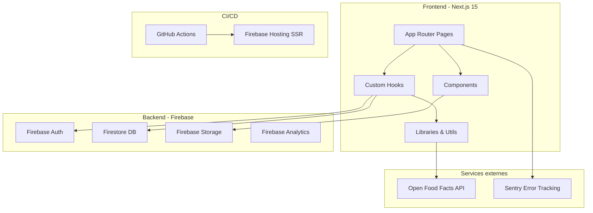
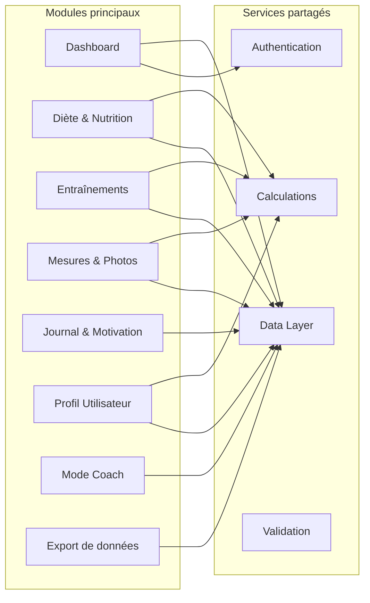
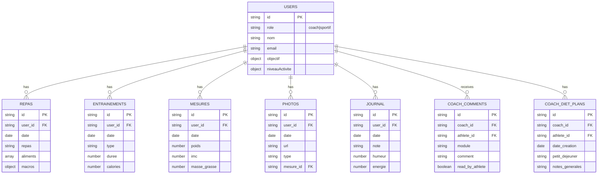
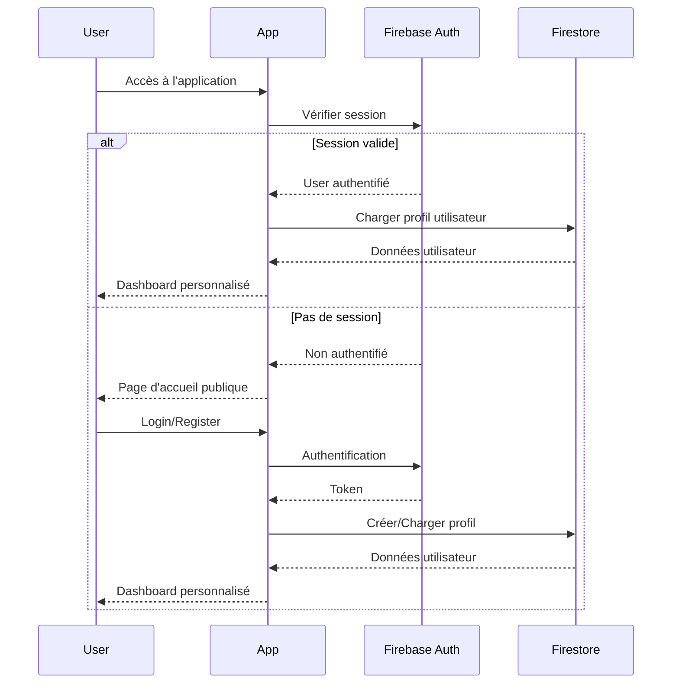
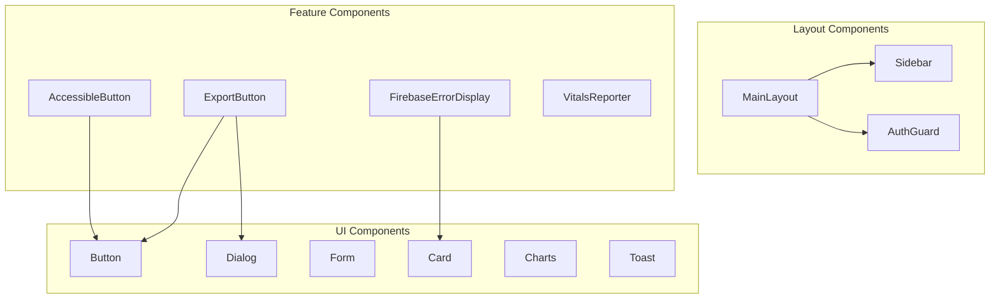

# 🏗️ Architecture SuperNovaFit

## Vue d'ensemble

SuperNovaFit est une application de fitness moderne développée avec Next.js 15.4.6 (App Router), TypeScript, Firebase et Tailwind CSS. L'application suit une architecture modulaire avec une séparation claire entre le frontend et les services backend.

## Architecture globale

## Architecture des modules

## Structure des données (Firestore)

## Flux d'authentification

## Architecture des composants

## Stack technique détaillée

### Frontend
- **Framework**: Next.js 15.4.6 (App Router)
- **Language**: TypeScript 5.3.3
- **Styling**: Tailwind CSS 3.4.0 + Glassmorphism theme
- **State Management**: Zustand 4.4.7
- **Forms**: React Hook Form 7.48.2 + Zod 3.25.76
- **Charts**: Recharts 2.10.3 + Chart.js 4.5.0
- **UI Components**: Radix UI primitives
- **Animations**: Framer Motion 10.16.16

### Backend & Services
- **Authentication**: Firebase Auth (Email/Password)
- **Database**: Firestore
- **Storage**: Firebase Storage
- **Analytics**: Firebase Analytics + Web Vitals
- **Error Tracking**: Sentry 10.5.0
- **APIs**: Open Food Facts (nutrition data)

### Build & Deployment
- **CI/CD**: GitHub Actions
- **Hosting**: Firebase Hosting SSR
- **Container**: Cloud Run (via Firebase)
- **Artifacts**: Artifact Registry

### Development Tools
- **Testing**: Vitest 3.2.4 + React Testing Library
- **Linting**: ESLint + TypeScript ESLint
- **Bundle Analysis**: Next.js Bundle Analyzer
- **Code Quality**: TypeScript strict mode

## Points d'entrée principaux

1. **`/` (Home)**: Landing page publique ou dashboard si connecté
2. **`/auth`**: Authentification (login/register)
3. **`/diete`**: Module nutrition
4. **`/entrainements`**: Module entraînements
5. **`/mesures`**: Module mesures corporelles
6. **`/journal`**: Module journal personnel
7. **`/profil`**: Gestion du profil
8. **`/coach/*`**: Espace coach
9. **`/export`**: Export de données

## Patterns architecturaux

### 1. **Hooks Pattern**
- Encapsulation de la logique Firebase dans des hooks custom
- Exemple: `useAuth`, `useFirestore`, `usePaginatedData`

### 2. **Error Boundary Pattern**
- Gestion centralisée des erreurs Firebase
- Hook `useFirebaseError` avec retry automatique

### 3. **Dynamic Import Pattern**
- Chargement différé des composants lourds (charts, modals)
- Optimisation du bundle initial

### 4. **Composition Pattern**
- Components UI réutilisables avec Radix UI
- Variants avec class-variance-authority

### 5. **Server-Side Rendering**
- Pages statiques générées au build
- Dynamic rendering pour les pages authentifiées

## Sécurité

### Firestore Rules
- Authentification requise pour toutes les collections
- Isolation des données par `user_id`
- Permissions spéciales pour les coaches
- Validation des structures de données

### Secrets Management
- Variables d'environnement pour les clés API
- GitHub Secrets pour CI/CD
- Compte de service pour déploiement

## Performance

### Optimisations appliquées
- Dynamic imports pour réduire le bundle
- Image optimization avec next/image (WebP)
- Preconnect pour les domaines externes
- Pagination Firestore pour les grandes listes
- Sections historiques fermées par défaut

### Métriques actuelles
- FCP: 0.44s (excellent)
- LCP: 1.31s (bon)
- TBT: 0.72s (à améliorer)
- CLS: 0.08 (excellent)

## Scalabilité

### Points forts
- Architecture modulaire facilement extensible
- Services Firebase auto-scalables
- SSR avec Cloud Run
- CDN via Firebase Hosting

### Points d'attention
- Pagination manuelle côté client sur certaines pages
- Pas de cache Redis/Memcached
- Queries Firestore non optimisées (manque d'indexes composites)