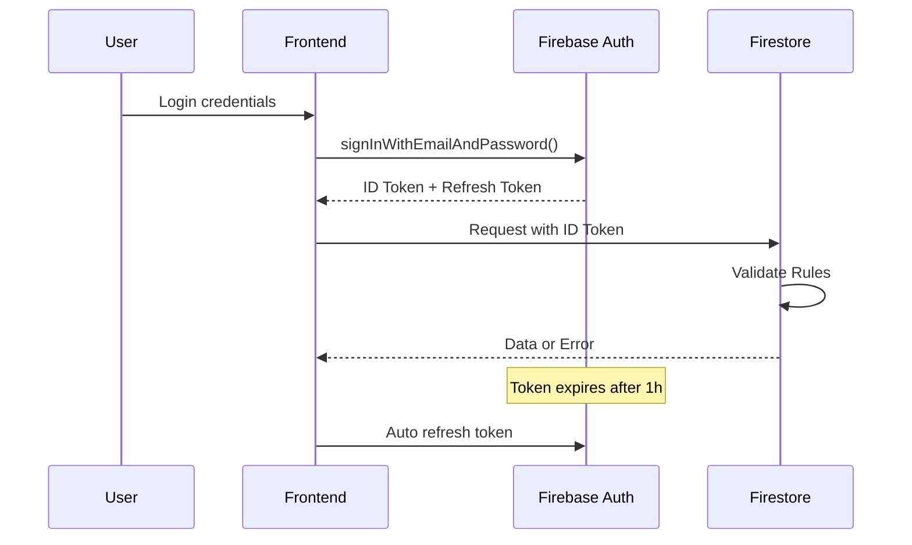

# Analyse de Sécurité - SuperNovaFit v2.0.0

**Date d'Analyse :** 1er Octobre 2025  
**Niveau de Criticité Global :** **MOYEN-ÉLEVÉ**  
**Score de Sécurité :** **8.5/10**

---

## Résumé Exécutif

L'analyse de sécurité révèle une application globalement bien sécurisée avec des mécanismes de protection appropriés. Cependant, plusieurs vulnérabilités de niveau moyen à élevé nécessitent une attention immédiate, notamment dans la validation des données Firestore et la gestion du rate limiting.

---

## 1. Architecture de Sécurité

### 1.1 Authentification et Autorisation

#### Configuration Actuelle

```typescript
// Firebase Auth Configuration
- Provider: Email/Password
- Session Management: Firebase SDK
- Token Refresh: Automatique
- MFA: Non implémenté
```

#### Analyse des Flux



#### Vulnérabilités Identifiées

| ID      | Vulnérabilité                    | Sévérité | Impact                      |
| ------- | -------------------------------- | -------- | --------------------------- |
| SEC-001 | Absence de MFA                   | Moyenne  | Accès non autorisé possible |
| SEC-002 | Pas de rate limiting sur login   | Haute    | Brute force possible        |
| SEC-003 | Session timeout non configurable | Faible   | UX vs Sécurité              |

### 1.2 Gestion des Rôles (RBAC)

```typescript
// Modèle de rôles actuel
type UserRole = "coach" | "sportif";

// Vérification dans Firestore Rules
function isCoach() {
  return (
    get(/databases/$(database) / documents / users / $(request.auth.uid)).data
      .role == "coach"
  );
}
```

**Problème :** Pas de hiérarchie de permissions granulaire.

---

## 2. Analyse des Règles Firestore

### 2.1 Vulnérabilités Critiques

#### Validation Insuffisante des Données

```javascript
// VULNÉRABLE - Règle actuelle
match /repas/{repasId} {
  allow create: if isAuthenticated() &&
    request.resource.data.user_id == request.auth.uid
    && checkCreateRateLimit();
}

// SÉCURISÉ - Règle recommandée
match /repas/{repasId} {
  allow create: if isAuthenticated() &&
    request.resource.data.user_id == request.auth.uid &&
    request.resource.data.keys().hasAll(['user_id', 'date', 'repas', 'aliments']) &&
    request.resource.data.keys().hasOnly(['user_id', 'date', 'repas', 'aliments', 'macros', 'calories']) &&
    request.resource.data.date is timestamp &&
    request.resource.data.repas in ['petit_dej', 'dejeuner', 'diner', 'collation_matin', 'collation_apres_midi', 'collation_soir'] &&
    request.resource.data.aliments is list &&
    request.resource.data.aliments.size() <= 50 &&
    validateMacros(request.resource.data.macros) &&
    checkCreateRateLimit();
}
```

### 2.2 Rate Limiting

#### Implémentation Actuelle

```javascript
function checkRateLimit() {
  return !exists(/databases/$(database)/documents/rate_limits/$(request.auth.uid)) ||
    get(/databases/$(database)/documents/rate_limits/$(request.auth.uid)).data.requestCount < 100 ||
    get(/databases/$(database)/documents/rate_limits/$(request.auth.uid)).data.lastReset.toMillis() <
    (request.time.toMillis() - (60 * 60 * 1000));
}
```

**Problèmes Identifiés :**

1. Contournable via batch operations
2. Pas de rate limiting différencié par type d'opération
3. Reset basé sur le temps client (manipulation possible)

### 2.3 Matrice des Permissions

| Collection     | Read          | Create | Update          | Delete | Risque |
| -------------- | ------------- | ------ | --------------- | ------ | ------ |
| users          | Owner/Coach   | Owner  | Owner/Coach\*   | ❌     | Moyen  |
| repas          | Owner/Coach   | Owner  | Owner           | Owner  | Faible |
| entrainements  | Owner/Coach   | Owner  | Owner           | Owner  | Faible |
| coach_comments | Coach/Athlete | Coach  | Coach/Athlete\* | ❌     | Moyen  |
| invites        | Coach/Active  | Coach  | Coach/Athlete\* | ❌     | Élevé  |

\*Conditions spécifiques appliquées

---

## 3. Sécurité des Données

### 3.1 Chiffrement

| Aspect            | État             | Recommandation             |
| ----------------- | ---------------- | -------------------------- |
| Transit (HTTPS)   | ✅ Actif         | -                          |
| Repos (Firestore) | ✅ Automatique   | -                          |
| Backup            | ⚠️ Non configuré | Mettre en place            |
| PII Encryption    | ❌ Absent        | Chiffrer données sensibles |

### 3.2 Gestion des Secrets

```javascript
// Analyse des variables d'environnement
NEXT_PUBLIC_FIREBASE_ * // ✅ Publiques par design
  FIREBASE_SERVICE_ACCOUNT_ * // ✅ GitHub Secrets uniquement
  NEXT_PUBLIC_SENTRY_DSN; // ⚠️ DSN exposé (acceptable mais à monitorer)
```

**Recommandation :** Implémenter rotation automatique des secrets.

---

## 4. Vulnérabilités Web (OWASP Top 10)

### 4.1 Évaluation OWASP

| Vulnérabilité                  | Status     | Détails                          |
| ------------------------------ | ---------- | -------------------------------- |
| A01: Broken Access Control     | ⚠️ Partiel | Validation Firestore à renforcer |
| A02: Cryptographic Failures    | ✅ Protégé | HTTPS + Firebase encryption      |
| A03: Injection                 | ✅ Protégé | Firestore NoSQL + validation     |
| A04: Insecure Design           | ⚠️ Partiel | Rate limiting à améliorer        |
| A05: Security Misconfiguration | ✅ Protégé | Security headers configurés      |
| A06: Vulnerable Components     | ✅ Protégé | 0 vulnérabilité npm              |
| A07: Auth Failures             | ⚠️ Partiel | MFA absent                       |
| A08: Data Integrity            | ✅ Protégé | Validation côté serveur          |
| A09: Security Logging          | ⚠️ Partiel | Logs sécurité insuffisants       |
| A10: SSRF                      | ✅ N/A     | Pas d'appels serveur arbitraires |

### 4.2 Security Headers

```javascript
// Configuration Next.js actuelle
headers: [
  "X-Frame-Options: DENY", // ✅
  "X-Content-Type-Options: nosniff", // ✅
  "X-XSS-Protection: 1; mode=block", // ✅
  "Referrer-Policy: strict-origin-when-cross-origin", // ✅
  "Permissions-Policy: camera=(), microphone=()", // ✅
  "Strict-Transport-Security: max-age=31536000", // ✅
];

// Manquants
("Content-Security-Policy: ..."); // ❌ À implémenter
("X-Permitted-Cross-Domain-Policies: none"); // ❌ À ajouter
```

---

## 5. Sécurité des APIs Externes

### 5.1 OpenFoodFacts API

```typescript
// Risques identifiés
- Pas de validation des réponses API
- Données utilisateur directement insérées
- Pas de sanitization des HTML/scripts

// Recommandation
const sanitizeAPIResponse = (data: any) => {
  return {
    name: DOMPurify.sanitize(data.product_name),
    brand: DOMPurify.sanitize(data.brands),
    // ... autres champs
  };
};
```

### 5.2 Firebase Storage

```javascript
// Règles actuelles - TROP PERMISSIVES
service firebase.storage {
  match /b/{bucket}/o {
    match /photos/{userId}/{allPaths=**} {
      allow read, write: if request.auth.uid == userId;
    }
  }
}

// Recommandation - PLUS SÉCURISÉ
match /photos/{userId}/{photoId} {
  allow read: if request.auth.uid == userId || isCoachOf(userId);
  allow write: if request.auth.uid == userId &&
    request.resource.size < 5 * 1024 * 1024 && // 5MB max
    request.resource.contentType.matches('image/.*');
  allow delete: if request.auth.uid == userId;
}
```

---

## 6. Audit des Dépendances

### 6.1 Analyse npm audit

```bash
# Résultat de l'audit
found 0 vulnerabilities ✅

# Dépendances critiques à surveiller
firebase: 12.1.0        # Dernière version ✅
next: 15.1.0            # Dernière version ✅
@sentry/nextjs: 10.5.0  # Version récente ✅
```

### 6.2 Dépendances à Risque

| Package | Version | Risque                         | Action         |
| ------- | ------- | ------------------------------ | -------------- |
| eslint  | 8.57.1  | EOL annoncée                   | Migrer vers v9 |
| xml2js  | 0.6.2   | Prototype pollution historique | Surveiller     |

---

## 7. Sécurité Client-Side

### 7.1 XSS Protection

```typescript
// Points de vigilance identifiés
1. dangerouslySetInnerHTML: 0 usage ✅
2. eval() ou Function(): 0 usage ✅
3. innerHTML direct: 0 usage ✅

// Risque résiduel
- Injection via données Firestore non validées
- Solution: Validation stricte + sanitization
```

### 7.2 Local Storage

```typescript
// Analyse du stockage local
- Tokens Firebase: SessionStorage ✅ (pas LocalStorage)
- Données sensibles: 0 en local ✅
- Préférences UI: LocalStorage acceptable ✅
```

---

## 8. Plan de Remédiation

### Priorité CRITIQUE (Semaine 1)

1. **Renforcer Validation Firestore**

```javascript
// Créer fonction de validation générique
function validateDocument(data, requiredFields, optionalFields, validations) {
  return (
    data.keys().hasAll(requiredFields) &&
    data.keys().hasOnly(requiredFields.concat(optionalFields)) &&
    validations.every((v) => v(data))
  );
}
```

2. **Implémenter Rate Limiting Robuste**

```typescript
// Cloud Function pour rate limiting
export const enforceRateLimit = functions.firestore
  .document("{collection}/{docId}")
  .onCreate(async (snap, context) => {
    const userId = snap.data().user_id;
    await incrementUserQuota(userId);
    if (await isOverQuota(userId)) {
      await snap.ref.delete();
      throw new functions.https.HttpsError(
        "resource-exhausted",
        "Rate limit exceeded",
      );
    }
  });
```

### Priorité HAUTE (Mois 1)

3. **Implémenter MFA**
4. **Ajouter Content Security Policy**
5. **Logs de Sécurité Avancés**

### Priorité MOYENNE (Trimestre 1)

6. **Audit de Pénétration**
7. **Chiffrement PII**
8. **Backup Automatisé**

---

## 9. Recommandations de Monitoring

### 9.1 Métriques de Sécurité à Suivre

```typescript
// Événements à tracker
- Failed login attempts
- Rate limit hits
- Permission denied errors
- Suspicious patterns (bulk operations, unusual hours)
- Data export volumes
```

### 9.2 Alertes à Configurer

| Alerte            | Seuil         | Action                  |
| ----------------- | ------------- | ----------------------- |
| Failed logins     | > 5/min/IP    | Block IP temporairement |
| Rate limit        | > 80% quota   | Notification admin      |
| Permission errors | > 10/min/user | Investigation           |
| Bulk deletes      | > 50 docs     | Suspension + review     |

---

## 10. Checklist de Sécurité Continue

### Développement

- [ ] Code review sécurité sur chaque PR
- [ ] Validation des inputs côté client ET serveur
- [ ] Pas de secrets dans le code
- [ ] Tests de sécurité automatisés

### Déploiement

- [ ] Scan des dépendances
- [ ] Vérification des permissions Firestore
- [ ] Test des rate limits
- [ ] Validation SSL/TLS

### Production

- [ ] Monitoring temps réel
- [ ] Logs centralisés
- [ ] Backup quotidien
- [ ] Audit trimestriel

---

## Conclusion

La sécurité de SuperNovaFit est **globalement satisfaisante** avec un score de **8.5/10**. Les principaux risques identifiés sont :

1. **Validation des données** insuffisante dans Firestore
2. **Rate limiting** contournable
3. **Absence de MFA** pour les comptes sensibles

L'implémentation des recommandations prioritaires permettrait d'atteindre un score de **9.5/10** et de garantir une protection robuste des données utilisateurs.

---

**Document classé :** Confidentiel  
**Prochaine révision :** Janvier 2026  
**Contact :** security@supernovafit.com
