# Plan d'Action - SuperNovaFit v2.0.0

**Date de Création :** 1er Octobre 2025  
**Période d'Exécution :** Octobre 2025 - Mars 2026  
**Budget Temps Estimé :** 180 heures  
**Équipe Requise :** 2-3 développeurs

---

## Vue d'Ensemble

Ce plan d'action détaille les étapes concrètes pour adresser les problèmes identifiés lors de l'audit technique. Les actions sont priorisées selon leur impact et leur urgence.

---

## 📊 Matrice de Priorisation

```mermaid
graph LR
    subgraph "🔴 CRITIQUE - Semaine 1"
        C1[Tests E2E Setup]
        C2[Firestore Validation]
        C3[Rate Limiting Fix]
    end

    subgraph "🟡 HAUTE - Mois 1"
        H1[Dynamic Imports]
        H2[Accessibility ARIA]
        H3[TypeScript Strict]
    end

    subgraph "🟢 MOYENNE - Trimestre 1"
        M1[Performance CDN]
        M2[Coverage 40%]
        M3[Mobile UX Polish]
    end

    C1 --> H1 --> M1
    C2 --> H2 --> M2
    C3 --> H3 --> M3
```



---

## 🚨 Phase 1 : Actions Critiques (Semaine 1)

### 1.1 Configuration Tests E2E

**Objectif :** Mettre en place infrastructure de tests automatisés  
**Effort :** 8 heures  
**Responsable :** Lead Developer

#### Étapes d'Implémentation

```bash
# 1. Installation Playwright
npm install -D @playwright/test
npx playwright install

# 2. Configuration
cat > playwright.config.ts << 'EOF'
import { defineConfig, devices } from '@playwright/test';

export default defineConfig({
  testDir: './e2e',
  fullyParallel: true,
  forbidOnly: !!process.env.CI,
  retries: process.env.CI ? 2 : 0,
  workers: process.env.CI ? 1 : undefined,
  reporter: 'html',
  use: {
    baseURL: 'http://localhost:3000',
    trace: 'on-first-retry',
  },
  projects: [
    {
      name: 'Mobile Chrome',
      use: { ...devices['Pixel 5'] },
    },
    {
      name: 'Desktop Chrome',
      use: { ...devices['Desktop Chrome'] },
    },
  ],
});
EOF

# 3. Premier test critique
mkdir -p e2e
cat > e2e/auth.spec.ts << 'EOF'
import { test, expect } from '@playwright/test';

test.describe('Authentication Flow', () => {
  test('should login successfully', async ({ page }) => {
    await page.goto('/auth');
    await page.fill('[name="email"]', 'test@example.com');
    await page.fill('[name="password"]', 'Test123!');
    await page.click('button[type="submit"]');
    await expect(page).toHaveURL('/dashboard');
  });
});
EOF
```

#### Critères de Succès

- [ ] 5 tests E2E sur parcours critiques
- [ ] CI/CD intégration
- [ ] Rapport de couverture généré

### 1.2 Renforcement Sécurité Firestore

**Objectif :** Corriger les vulnérabilités de validation  
**Effort :** 4 heures  
**Responsable :** Security Lead

#### Patch Immédiat

```javascript
// config/firestore.rules
rules_version = '2';

service cloud.firestore {
  match /databases/{database}/documents {
    // Fonction de validation générique
    function validateFields(data, required, optional) {
      return data.keys().hasAll(required) &&
             data.keys().hasOnly(required.concat(optional));
    }

    // Validation spécifique repas
    function validateRepas(data) {
      return validateFields(data,
        ['user_id', 'date', 'repas', 'aliments'],
        ['macros', 'calories', 'notes']) &&
        data.date is timestamp &&
        data.repas in ['petit_dej', 'dejeuner', 'diner',
                      'collation_matin', 'collation_apres_midi', 'collation_soir'] &&
        data.aliments is list &&
        data.aliments.size() > 0 &&
        data.aliments.size() <= 50;
    }

    match /repas/{repasId} {
      allow create: if isAuthenticated() &&
        request.resource.data.user_id == request.auth.uid &&
        validateRepas(request.resource.data) &&
        checkCreateRateLimit();

      allow update: if isAuthenticated() &&
        resource.data.user_id == request.auth.uid &&
        request.resource.data.user_id == request.auth.uid &&
        validateRepas(request.resource.data) &&
        checkRateLimit();
    }
  }
}
```

#### Tests de Validation

```typescript
// __tests__/firestore-rules-validation.test.ts
describe("Firestore Rules Validation", () => {
  test("should reject invalid meal type", async () => {
    const invalidMeal = {
      user_id: "user123",
      date: new Date(),
      repas: "invalid_type", // Invalid
      aliments: [],
    };

    await expect(addDoc(collection(db, "repas"), invalidMeal)).rejects.toThrow(
      "PERMISSION_DENIED",
    );
  });

  test("should reject oversized arrays", async () => {
    const oversizedMeal = {
      user_id: "user123",
      date: new Date(),
      repas: "dejeuner",
      aliments: new Array(51).fill({}), // 51 items
    };

    await expect(
      addDoc(collection(db, "repas"), oversizedMeal),
    ).rejects.toThrow("PERMISSION_DENIED");
  });
});
```

---

## ⚡ Phase 2 : Quick Wins (Semaine 2)

### 2.1 Dynamic Imports Implementation

**Objectif :** Réduire bundle size de 80KB  
**Effort :** 4 heures  
**ROI :** Très élevé

#### Implementation Guide

```typescript
// src/components/charts/index.ts
import dynamic from 'next/dynamic';
import { ChartSkeleton } from '@/components/ui/Skeletons';

// Créer un wrapper pour chaque chart
export const MacrosChart = dynamic(
  () => import('./MacrosChart').then(mod => mod.MacrosChart),
  {
    loading: () => <ChartSkeleton type="pie" />,
    ssr: false
  }
);

export const PerformanceChart = dynamic(
  () => import('./PerformanceChart').then(mod => mod.PerformanceChart),
  {
    loading: () => <ChartSkeleton type="line" />,
    ssr: false
  }
);

// Préchargement intelligent
export const preloadCharts = () => {
  if (typeof window !== 'undefined' && window.innerWidth > 768) {
    import('./MacrosChart');
    import('./PerformanceChart');
  }
};
```

#### Migration Progressive

```typescript
// src/app/diete/page.tsx
- import { MacrosChart } from '@/components/charts/MacrosChart';
+ import { MacrosChart, preloadCharts } from '@/components/charts';

export default function DietePage() {
  useEffect(() => {
    // Précharger les charts après le rendu initial
    const timer = setTimeout(preloadCharts, 1000);
    return () => clearTimeout(timer);
  }, []);

  return (
    <Suspense fallback={<ChartSkeleton />}>
      <MacrosChart data={macrosData} />
    </Suspense>
  );
}
```

### 2.2 Accessibility Quick Fixes

**Objectif :** Conformité WCAG 2.2 niveau AA  
**Effort :** 6 heures

#### Checklist d'Implementation

```typescript
// src/components/ui/FormField.tsx
interface FormFieldProps {
  label: string;
  name: string;
  required?: boolean;
  error?: string;
  helpText?: string;
}

export const FormField: FC<FormFieldProps> = ({
  label,
  name,
  required,
  error,
  helpText,
  ...props
}) => {
  const fieldId = `field-${name}`;
  const errorId = `error-${name}`;
  const helpId = `help-${name}`;

  return (
    <div className="form-field">
      <label
        htmlFor={fieldId}
        className="block text-sm font-medium mb-1"
      >
        {label}
        {required && <span className="text-red-500" aria-label="requis">*</span>}
      </label>

      <input
        id={fieldId}
        name={name}
        aria-required={required}
        aria-invalid={!!error}
        aria-describedby={`${error ? errorId : ''} ${helpText ? helpId : ''}`}
        className={cn(
          "w-full px-3 py-2 border rounded-lg",
          error && "border-red-500"
        )}
        {...props}
      />

      {helpText && (
        <p id={helpId} className="text-sm text-gray-600 mt-1">
          {helpText}
        </p>
      )}

      {error && (
        <p id={errorId} role="alert" className="text-sm text-red-500 mt-1">
          {error}
        </p>
      )}
    </div>
  );
};
```

---

## 🎯 Phase 3 : Optimisations Majeures (Mois 1-2)

### 3.1 Augmentation Coverage Tests

**Objectif :** Passer de 4% à 25% de coverage  
**Effort :** 40 heures

#### Plan de Test par Module

| Module     | Coverage Actuel | Cible | Tests à Créer |
| ---------- | --------------- | ----- | ------------- |
| Pages      | 0%              | 30%   | 15 tests      |
| Components | 2%              | 40%   | 25 tests      |
| Hooks      | 12%             | 60%   | 10 tests      |
| Lib        | 76%             | 90%   | 5 tests       |

#### Template de Test Component

```typescript
// __tests__/components/ui/Button.test.tsx
import { render, screen, fireEvent } from '@testing-library/react';
import { Button } from '@/components/ui/Button';

describe('Button Component', () => {
  it('renders with text', () => {
    render(<Button>Click me</Button>);
    expect(screen.getByRole('button')).toHaveTextContent('Click me');
  });

  it('handles click events', () => {
    const handleClick = jest.fn();
    render(<Button onClick={handleClick}>Click</Button>);
    fireEvent.click(screen.getByRole('button'));
    expect(handleClick).toHaveBeenCalledTimes(1);
  });

  it('can be disabled', () => {
    render(<Button disabled>Disabled</Button>);
    expect(screen.getByRole('button')).toBeDisabled();
  });

  it('applies variant styles', () => {
    render(<Button variant="primary">Primary</Button>);
    expect(screen.getByRole('button')).toHaveClass('bg-blue-500');
  });
});
```

### 3.2 Performance Optimization

**Objectif :** LCP < 2s sur mobile  
**Effort :** 20 heures

#### Optimisations Planifiées

```typescript
// 1. Image CDN Proxy
// src/lib/image-optimizer.ts
export function getOptimizedImageUrl(url: string, options: ImageOptions = {}) {
  const { width = 800, quality = 75, format = 'webp' } = options;

  // Pour OpenFoodFacts
  if (url.includes('openfoodfacts.org')) {
    return `https://cdn.supernovafit.com/proxy?url=${encodeURIComponent(url)}&w=${width}&q=${quality}&f=${format}`;
  }

  // Pour Firebase Storage
  if (url.includes('firebasestorage')) {
    return `${url}?w=${width}&q=${quality}`;
  }

  return url;
}

// 2. Virtualisation des listes
// src/components/ui/VirtualList.tsx
import { FixedSizeList } from 'react-window';

export const VirtualMealsList = ({ meals }) => {
  const Row = ({ index, style }) => (
    <div style={style}>
      <MealCard meal={meals[index]} />
    </div>
  );

  return (
    <FixedSizeList
      height={600}
      itemCount={meals.length}
      itemSize={120}
      width="100%"
    >
      {Row}
    </FixedSizeList>
  );
};
```

---

## 📅 Timeline Détaillé

### Octobre 2025 (Semaine 1-2)

- [x] Setup tests E2E
- [x] Fix sécurité Firestore
- [x] Dynamic imports charts
- [ ] Accessibility quick fixes

### Novembre 2025 (Semaine 3-6)

- [ ] Tests unitaires components
- [ ] TypeScript strict mode
- [ ] Mobile gesture optimization
- [ ] Performance monitoring setup

### Décembre 2025 (Semaine 7-10)

- [ ] Coverage 25% atteint
- [ ] CDN images externes
- [ ] Bundle < 100KB
- [ ] WCAG 2.2 compliance

### Janvier-Mars 2026 (Trimestre 1)

- [ ] Coverage 40%
- [ ] Full E2E test suite
- [ ] Performance budget automation
- [ ] Accessibility AAA

---

## 📊 KPIs de Suivi

### Métriques Techniques

| KPI               | Baseline | Target 30j | Target 90j |
| ----------------- | -------- | ---------- | ---------- |
| Test Coverage     | 3.98%    | 25%        | 40%        |
| Bundle Size       | 110KB    | 90KB       | 75KB       |
| LCP Mobile        | 2.5s     | 2.0s       | 1.5s       |
| TypeScript Strict | 92%      | 100%       | 100%       |
| WCAG Score        | 85%      | 95%        | 99%        |

### Métriques Business

| KPI                   | Impact Attendu | Mesure             |
| --------------------- | -------------- | ------------------ |
| User Retention        | +15%           | Firebase Analytics |
| Page Load Abandonment | -30%           | GA4                |
| Error Rate            | -50%           | Sentry             |
| User Satisfaction     | +20%           | NPS Survey         |

---

## 🛠️ Ressources Requises

### Équipe

- **Lead Developer** : 60h (coordination + implémentation critique)
- **Frontend Developer** : 80h (UI/UX + tests)
- **DevOps** : 20h (CI/CD + monitoring)
- **QA** : 20h (tests E2E + validation)

### Outils

```bash
# Dépendances à installer
npm install -D @playwright/test
npm install -D @testing-library/react @testing-library/jest-dom
npm install -D @axe-core/react
npm install react-window react-intersection-observer
npm install -D @next/bundle-analyzer
```

### Budget

- **Temps Total** : 180 heures
- **Coût Estimé** : 18,000€ (100€/h moyen)
- **ROI Attendu** : 300% sur 6 mois

---

## ✅ Checklist de Validation

### Semaine 1

- [ ] Tests E2E fonctionnels
- [ ] Firestore rules déployées
- [ ] Rate limiting testé
- [ ] Documentation mise à jour

### Semaine 2

- [ ] Dynamic imports merged
- [ ] Bundle size < 100KB
- [ ] ARIA labels ajoutés
- [ ] TypeScript any éliminés

### Mois 1

- [ ] Coverage > 15%
- [ ] LCP < 2.2s
- [ ] 0 erreurs accessibilité critique
- [ ] Monitoring actif

### Trimestre 1

- [ ] Coverage > 40%
- [ ] Performance budget respecté
- [ ] WCAG 2.2 AA certifié
- [ ] 0 régression détectée

---

## 📝 Notes et Risques

### Risques Identifiés

1. **Résistance au changement** : Formation équipe nécessaire
2. **Complexité tests** : Prévoir temps supplémentaire
3. **Performance dégradation** : Monitoring continu requis

### Mitigation

- Sessions de formation hebdomadaires
- Pair programming sur parties complexes
- Rollback strategy définie
- Feature flags pour déploiements progressifs

---

## 🎯 Conclusion

Ce plan d'action permet d'adresser systématiquement tous les problèmes identifiés lors de l'audit. La priorisation par impact garantit un ROI rapide tout en améliorant la qualité globale de l'application.

**Prochaine Étape :** Validation du plan avec l'équipe et lancement Phase 1.

---

**Document approuvé par :** [À compléter]  
**Date de début :** [À définir]  
**Revue hebdomadaire :** Chaque vendredi 14h
