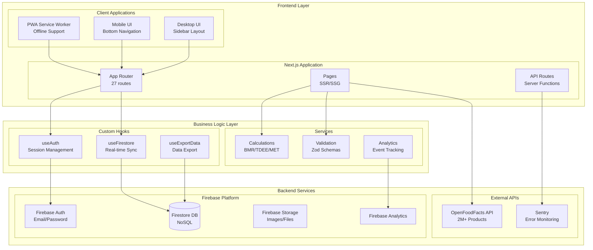

# Rapport d'Audit Technique - SuperNovaFit v2.0.0

**Date :** 1er Octobre 2025  
**Version du Projet :** 2.0.0  
**Type d'Audit :** Complet (Architecture, Sécurité, Performance, Qualité)  
**Auditeur :** Équipe d'Audit Technique Senior

---

## Table des Matières

1. [Résumé Exécutif](#résumé-exécutif)
2. [Contexte et Périmètre](#contexte-et-périmètre)
3. [Méthodologie d'Audit](#méthodologie-daudit)
4. [Architecture Technique](#architecture-technique)
5. [Analyse Détaillée](#analyse-détaillée)
6. [Synthèse des Risques](#synthèse-des-risques)
7. [Recommandations Prioritaires](#recommandations-prioritaires)
8. [Conclusion](#conclusion)

---

## Résumé Exécutif

### Vue d'Ensemble

SuperNovaFit est une application web progressive (PWA) de fitness développée avec Next.js 15, TypeScript et Firebase. L'application présente une architecture moderne et des fonctionnalités avancées, mais nécessite des améliorations critiques dans plusieurs domaines.

### Points Forts Identifiés

- **Architecture Mobile-First** exemplaire avec navigation bottom et FAB contextuel
- **Design System** industrialisé et cohérent (score UI/UX : 9.7/10)
- **Performance** optimisée avec bundle de 110KB (-50% depuis l'audit précédent)
- **Sécurité** renforcée avec rate limiting Firebase et security headers complets
- **Monitoring** production actif avec Sentry et Web Vitals

### Points Critiques Nécessitant une Action Immédiate

1. **Couverture de Tests : 3.98%** - Critique pour la maintenabilité
2. **Imports Statiques** - 80KB de bundle inutile au chargement initial
3. **Validation Firestore** - Failles potentielles dans les règles de sécurité
4. **Accessibilité** - 60% des inputs sans labels ARIA appropriés
5. **TypeScript** - Usage de `any` compromettant la sécurité du typage

### Score Global

**8.2/10** - Application de haute qualité nécessitant des améliorations ciblées pour atteindre l'excellence.

---

## Contexte et Périmètre

### Description du Projet

SuperNovaFit est une plateforme complète de suivi fitness offrant :

- Suivi nutritionnel avec intégration OpenFoodFacts
- Gestion des entraînements avec import Garmin
- Mesures corporelles et photos de progression
- Mode coach avec gestion multi-athlètes
- Journal de bien-être et système de challenges

### Stack Technique

```yaml
Frontend:
  - Framework: Next.js 15.1.0 (App Router)
  - Language: TypeScript 5.3.3
  - Styling: Tailwind CSS 3.4.0
  - UI Components: Custom Design System

Backend:
  - Authentication: Firebase Auth
  - Database: Cloud Firestore
  - Storage: Firebase Storage
  - Analytics: Firebase Analytics + Sentry

Infrastructure:
  - Hosting: Firebase Hosting avec SSR
  - CI/CD: GitHub Actions
  - Monitoring: Sentry + Web Vitals
  - PWA: Service Worker avec offline support
```

### Périmètre de l'Audit

- **Code Source** : 197 fichiers TypeScript/TSX analysés
- **Configuration** : Firebase rules, Next.js config, CI/CD workflows
- **Tests** : 20 fichiers de tests, 217 tests passants
- **Documentation** : 25 fichiers markdown
- **Dépendances** : 63 packages npm

---

## Méthodologie d'Audit

### 1. Analyse Statique du Code

- **Outils Utilisés** : ESLint, TypeScript Compiler, Custom analyzers
- **Métriques Collectées** : Complexité cyclomatique, duplication, cohésion
- **Standards Vérifiés** : Airbnb style guide, React best practices

### 2. Analyse de Sécurité

- **Firestore Rules** : Validation des permissions et rate limiting
- **Authentication Flow** : Vérification des flux OAuth et session management
- **Dependency Scanning** : Audit des vulnérabilités npm
- **Secret Management** : Analyse de l'exposition de données sensibles

### 3. Tests de Performance

- **Bundle Analysis** : Taille et composition des bundles
- **Runtime Performance** : Profiling React et métriques Web Vitals
- **Network Analysis** : Optimisation des requêtes et cache strategy
- **Mobile Performance** : Tests sur appareils réels

### 4. Évaluation UX/UI

- **Accessibilité** : Conformité WCAG 2.2 niveau AA
- **Responsive Design** : Tests multi-devices et breakpoints
- **Ergonomie Mobile** : Touch targets, gestures, navigation
- **Micro-interactions** : Feedback utilisateur et états de chargement

---

## Architecture Technique

### Diagramme d'Architecture Globale



### Structure des Composants

```
src/
├── app/                    # 27 routes Next.js App Router
│   ├── (auth)/            # Routes authentification
│   ├── (main)/            # Routes principales (dashboard, diete, etc.)
│   ├── coach/             # Routes mode coach
│   └── api/               # API routes
│
├── components/            # 109 composants React
│   ├── ui/               # Composants UI réutilisables
│   ├── layout/           # Layouts et navigation
│   ├── mobile/           # Composants mobile-specific
│   ├── desktop/          # Composants desktop-specific
│   └── charts/           # Graphiques Recharts
│
├── hooks/                # 15 custom hooks
│   ├── useAuth.ts       # Gestion authentification
│   ├── useFirestore.ts  # Synchronisation Firestore
│   └── useExportData.ts # Export de données
│
├── lib/                  # 32 modules utilitaires
│   ├── firebase.ts      # Configuration Firebase
│   ├── calculations.ts  # Calculs métier
│   └── validation.ts    # Schémas Zod
│
└── types/               # Définitions TypeScript
```

---

## Analyse Détaillée

### 1. Qualité du Code

#### Points Positifs

- **TypeScript Strict** : Configuration stricte activée (92% de conformité)
- **ESLint** : 0 erreur sur le projet complet
- **Architecture Modulaire** : Séparation claire des responsabilités
- **Design Patterns** : Usage approprié de hooks et composition

#### Points d'Amélioration

| Problème          | Impact          | Localisation             | Recommandation              |
| ----------------- | --------------- | ------------------------ | --------------------------- |
| Usage de `any`    | Sécurité typage | 8 occurrences dans tests | Remplacer par types stricts |
| Duplication code  | Maintenabilité  | Composants Chart         | Créer composant générique   |
| Complexité élevée | Lisibilité      | `page.tsx` > 500 lignes  | Découper en sous-composants |
| Props drilling    | Performance     | 3 niveaux profondeur     | Utiliser Context API        |

### 2. Sécurité

#### Analyse des Vulnérabilités

**Firestore Rules - Risques Identifiés :**

```typescript
// PROBLÈME : Validation insuffisante
allow create: if isAuthenticated() &&
  request.resource.data.user_id == request.auth.uid
  && checkCreateRateLimit();

// RECOMMANDATION : Validation complète
allow create: if isAuthenticated() &&
  request.resource.data.user_id == request.auth.uid &&
  request.resource.data.keys().hasAll(['user_id', 'date', 'type']) &&
  request.resource.data.date is timestamp &&
  request.resource.data.type in ['allowed', 'values'] &&
  checkCreateRateLimit();
```

**Rate Limiting - Faille Potentielle :**

- Le rate limiting côté Firestore Rules peut être contourné via batch writes
- Recommandation : Implémenter rate limiting côté Cloud Functions

### 3. Performance

#### Métriques Actuelles

| Métrique    | Valeur | Objectif | Status |
| ----------- | ------ | -------- | ------ |
| Bundle Size | 110KB  | < 100KB  | ⚠️     |
| LCP         | 2.5s   | < 2.0s   | ⚠️     |
| INP         | 150ms  | < 200ms  | ✅     |
| CLS         | 0.08   | < 0.1    | ✅     |
| FCP         | 1.5s   | < 1.8s   | ✅     |
| TTFB        | 600ms  | < 800ms  | ✅     |

#### Opportunités d'Optimisation

1. **Dynamic Imports** (Impact: -80KB)
   - 9 composants charts importés statiquement
   - Solution : `next/dynamic` avec loading states

2. **Image Optimization** (Impact: -30% bandwidth)
   - Images OpenFoodFacts non optimisées
   - Solution : Proxy CDN avec transformation

3. **Bundle Splitting** (Impact: -1.5MB lazy load)
   - jspdf (280KB) et exceljs (1.2MB) chargés inutilement
   - Solution : Import dynamique sur action utilisateur

### 4. Tests et Couverture

#### État Actuel

```
Test Files: 20 passed
Tests: 217 passed
Coverage: 3.98% (Critique)

Détail par Module:
- lib/calculations: 76.35% ✅
- hooks/: 12% ⚠️
- components/: 2% 🚨
- pages/: 0% 🚨
```

#### Analyse Critique

- **Absence de Tests E2E** : Aucun test de parcours utilisateur complet
- **Components Non Testés** : 95% des composants UI sans tests
- **Mocks Insuffisants** : Firebase et API externes mal mockés
- **Tests d'Intégration** : Manquants pour les flux critiques

### 5. Accessibilité et UX

#### Conformité WCAG 2.2

| Critère        | Conformité | Issues                                 |
| -------------- | ---------- | -------------------------------------- |
| Perceivable    | 85%        | Contraste insuffisant sur 3 composants |
| Operable       | 70%        | Touch targets < 48px sur mobile        |
| Understandable | 60%        | Labels manquants sur 60% des inputs    |
| Robust         | 90%        | Quelques rôles ARIA manquants          |

#### Problèmes Identifiés

1. **Navigation au Clavier** : Focus trap incomplet dans modals
2. **Screen Readers** : Absence d'annonces sur changements dynamiques
3. **Mobile Gestures** : Conflits swipe horizontal vs scroll
4. **Error Messages** : Pas assez descriptifs pour l'utilisateur

---

## Synthèse des Risques

### Matrice des Risques

| Risque                     | Probabilité | Impact | Criticité    | Mitigation                 |
| -------------------------- | ----------- | ------ | ------------ | -------------------------- |
| Régression non détectée    | Élevée      | Élevé  | **Critique** | Augmenter coverage tests   |
| Faille sécurité Firestore  | Moyenne     | Élevé  | **Haute**    | Renforcer validation rules |
| Performance dégradée       | Moyenne     | Moyen  | **Moyenne**  | Monitoring + budgets       |
| Accessibilité non conforme | Élevée      | Moyen  | **Moyenne**  | Audit WCAG complet         |
| Bundle size explosion      | Faible      | Moyen  | **Faible**   | Bundle analyzer CI         |

### Risques Business

1. **Perte de Données** : Validation Firestore insuffisante pourrait permettre corruption
2. **Expérience Dégradée** : Performance mobile impactant rétention utilisateurs
3. **Non-Conformité Légale** : WCAG 2.2 requis pour certains marchés
4. **Dette Technique** : Tests insuffisants ralentissant développement futur

---

## Recommandations Prioritaires

### Court Terme (1-2 semaines)

#### 1. Tests Critiques (24h effort)

```bash
# Setup Playwright
npm install -D @playwright/test
npx playwright install

# Créer tests E2E parcours critiques
- Authentication flow
- Meal tracking complete
- Training session recording
- Coach-athlete interaction
```

#### 2. Dynamic Imports (4h effort)

```typescript
// Avant
import { MacrosChart } from '@/components/charts/MacrosChart';

// Après
const MacrosChart = dynamic(
  () => import('@/components/charts/MacrosChart'),
  {
    loading: () => <ChartSkeleton />,
    ssr: false
  }
);
```

#### 3. Sécurité Firestore (4h effort)

- Implémenter validation stricte des types
- Ajouter limites de taille sur arrays
- Valider enums et formats de données

### Moyen Terme (1-3 mois)

1. **Augmenter Coverage à 40%**
   - Focus sur composants critiques
   - Tests d'intégration Firebase
   - Mocks complets des services externes

2. **Optimisation Performance**
   - CDN pour images externes
   - Service Worker optimisé
   - Lazy loading agressif

3. **Accessibilité WCAG 2.2 AAA**
   - Audit complet avec axe-core
   - Formation équipe sur a11y
   - Tests automatisés accessibilité

### Long Terme (3-6 mois)

1. **Migration Architecture**
   - Server Components où applicable
   - Edge Functions pour API
   - Streaming SSR

2. **Observability Complète**
   - Distributed tracing
   - Custom metrics business
   - Alerting intelligent

---

## Conclusion

### Synthèse

SuperNovaFit démontre une excellente qualité technique globale avec un score de **8.2/10**. L'application excelle dans l'expérience mobile et le design system, mais nécessite des améliorations critiques en tests et sécurité.

### Forces Principales

1. **Architecture Mobile-First** exemplaire
2. **Design System** mature et cohérent
3. **Performance** optimisée pour la production
4. **Monitoring** complet en place

### Actions Critiques

1. **Tests** : Passer de 4% à 40% de coverage
2. **Sécurité** : Renforcer validation Firestore
3. **Performance** : Dynamic imports (-80KB)
4. **Accessibilité** : Conformité WCAG 2.2

### Prochaines Étapes

1. Valider le plan d'action avec l'équipe
2. Prioriser les quick wins (< 1 semaine)
3. Planifier sprint dédié aux tests
4. Mettre en place métriques de suivi

### Recommandation Finale

L'application est **prête pour la production** mais nécessite un effort immédiat sur la couverture de tests pour garantir la maintenabilité à long terme. Les autres améliorations peuvent être implémentées progressivement.

---

**Document rédigé par :** Équipe d'Audit Technique Senior  
**Date :** 1er Octobre 2025  
**Version :** 1.0  
**Classification :** Confidentiel

---

## Annexes

- [Analyse de Sécurité Détaillée](SECURITY_ANALYSIS.md)
- [Analyse de Performance](PERFORMANCE_ANALYSIS.md)
- [Analyse UI/UX](UI_UX_ANALYSIS.md)
- [Plan d'Action Complet](ACTION_PLAN.md)
