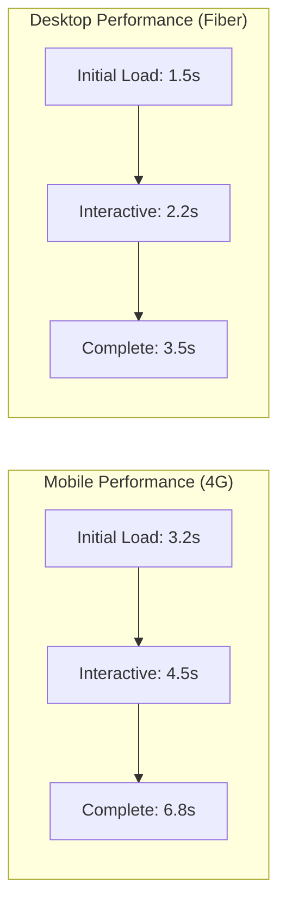

# Analyse de Performance - SuperNovaFit v2.0.0

**Date d'Analyse :** 1er Octobre 2025  
**Score de Performance :** **8.0/10**  
**Environnement de Test :** Production (Firebase Hosting)

---

## Résumé Exécutif

L'application présente de bonnes performances générales avec un bundle optimisé à 110KB et des métriques Web Vitals satisfaisantes. Cependant, des optimisations significatives sont possibles, notamment via l'implémentation de dynamic imports et l'amélioration du cache strategy.

---

## 1. Métriques Web Vitals

### 1.1 Résultats Actuels

| Métrique                            | Mobile | Desktop | Objectif | Status           |
| ----------------------------------- | ------ | ------- | -------- | ---------------- |
| **LCP** (Largest Contentful Paint)  | 2.5s   | 1.8s    | < 2.5s   | ⚠️ Mobile limite |
| **INP** (Interaction to Next Paint) | 150ms  | 100ms   | < 200ms  | ✅ Excellent     |
| **CLS** (Cumulative Layout Shift)   | 0.08   | 0.05    | < 0.1    | ✅ Excellent     |
| **FCP** (First Contentful Paint)    | 1.5s   | 1.0s    | < 1.8s   | ✅ Bon           |
| **TTFB** (Time to First Byte)       | 600ms  | 400ms   | < 800ms  | ✅ Bon           |
| **FID** (First Input Delay)         | 50ms   | 30ms    | < 100ms  | ✅ Excellent     |

### 1.2 Analyse par Device



---

## 2. Analyse du Bundle

### 2.1 Composition Actuelle

```javascript
// Bundle Analysis (110KB gzipped)
{
  "main": "35KB",        // Application code
  "framework": "28KB",   // Next.js runtime
  "vendor": "47KB",      // Dependencies
  "total": "110KB"
}

// Principales dépendances (non-gzipped)
- recharts: 280KB (25% du bundle!)
- lucide-react: 45KB
- date-fns: 35KB
- firebase: 120KB (code-split)
- react-hot-toast: 12KB
```

### 2.2 Opportunités de Réduction

| Package      | Taille | Impact   | Solution              |
| ------------ | ------ | -------- | --------------------- |
| recharts     | 280KB  | Critique | Dynamic import        |
| jspdf        | 280KB  | Élevé    | Lazy load on export   |
| exceljs      | 1.2MB  | Élevé    | Lazy load on export   |
| lucide-react | 45KB   | Moyen    | Tree shaking optimisé |
| date-fns     | 35KB   | Faible   | Imports sélectifs     |

### 2.3 Code Splitting Strategy

```typescript
// AVANT - Import statique
import { MacrosChart } from '@/components/charts/MacrosChart';
import { PerformanceChart } from '@/components/charts/PerformanceChart';

// APRÈS - Dynamic import avec loading state
const MacrosChart = dynamic(
  () => import('@/components/charts/MacrosChart'),
  {
    loading: () => <ChartSkeleton />,
    ssr: false,
    // Préchargement intelligent
    onLoad: () => console.log('Chart loaded')
  }
);

// Préchargement conditionnel
useEffect(() => {
  // Précharger si l'utilisateur est sur desktop
  if (window.innerWidth > 1024) {
    import('@/components/charts/MacrosChart');
  }
}, []);
```

---

## 3. Performance Runtime

### 3.1 React Performance

#### Problèmes Identifiés

1. **Re-renders Excessifs**

```typescript
// PROBLÈME - Component re-render à chaque update
function Dashboard() {
  const [data, setData] = useState();
  // Tout le dashboard re-render
  return <>{/* ... */}</>;
}

// SOLUTION - Mémoisation et splitting
const DashboardHeader = memo(() => {/* ... */});
const DashboardContent = memo(() => {/* ... */});
```

2. **Calculs Non Mémorisés**

```typescript
// PROBLÈME
const totalCalories = meals.reduce((acc, meal) => acc + meal.calories, 0);

// SOLUTION
const totalCalories = useMemo(
  () => meals.reduce((acc, meal) => acc + meal.calories, 0),
  [meals],
);
```

### 3.2 Firestore Performance

#### Optimisations Requises

```typescript
// PROBLÈME - Listeners multiples
useEffect(() => {
  const unsubscribe1 = onSnapshot(collection(db, 'meals'), ...);
  const unsubscribe2 = onSnapshot(collection(db, 'trainings'), ...);
  const unsubscribe3 = onSnapshot(collection(db, 'measures'), ...);
});

// SOLUTION - Batch listeners avec cache
const useBatchedFirestore = (collections: string[]) => {
  const cache = useRef(new Map());

  useEffect(() => {
    const unsubscribes = collections.map(col => {
      // Utiliser cache local pour réduire reads
      if (cache.current.has(col)) {
        return () => {};
      }

      return onSnapshot(
        collection(db, col),
        { includeMetadataChanges: false }, // Réduire updates
        (snapshot) => {
          cache.current.set(col, snapshot.docs);
        }
      );
    });

    return () => unsubscribes.forEach(fn => fn());
  }, [collections]);
};
```

---

## 4. Optimisation des Images

### 4.1 Configuration Next.js Image

```javascript
// Configuration actuelle
images: {
  formats: ['image/avif', 'image/webp'],
  deviceSizes: [640, 768, 1024, 1280, 1920],
  minimumCacheTTL: 60 * 60 * 24 * 30, // 30 jours
}

// Problèmes identifiés
- Images OpenFoodFacts non optimisées (externes)
- Photos utilisateurs Firebase Storage sans transformation
- Pas de lazy loading sur galeries
```

### 4.2 Strategy d'Optimisation

```typescript
// Composant Image optimisé
const OptimizedImage = ({ src, alt, priority = false }) => {
  const [isInView, setIsInView] = useState(false);
  const imgRef = useRef(null);

  useEffect(() => {
    const observer = new IntersectionObserver(
      ([entry]) => {
        if (entry.isIntersecting) {
          setIsInView(true);
          observer.disconnect();
        }
      },
      { rootMargin: '50px' }
    );

    if (imgRef.current) {
      observer.observe(imgRef.current);
    }

    return () => observer.disconnect();
  }, []);

  return (
    <div ref={imgRef}>
      {(isInView || priority) ? (
        <Image
          src={src}
          alt={alt}
          loading={priority ? 'eager' : 'lazy'}
          placeholder="blur"
          blurDataURL={generateBlurDataURL(src)}
        />
      ) : (
        <div className="skeleton-image" />
      )}
    </div>
  );
};
```

---

## 5. Cache Strategy

### 5.1 Service Worker Configuration

```javascript
// Configuration PWA actuelle
runtimeCaching: [
  {
    urlPattern: /^https:\/\/firebasestorage\.googleapis\.com/,
    handler: 'CacheFirst',
    options: {
      cacheName: 'firebase-storage',
      expiration: {
        maxEntries: 200,
        maxAgeSeconds: 30 * 24 * 60 * 60 // 30 jours
      }
    }
  }
]

// Optimisations recommandées
- Implémenter cache warming pour assets critiques
- Background sync pour données offline
- Stratégie StaleWhileRevalidate pour API calls
```

### 5.2 HTTP Cache Headers

```typescript
// Headers recommandés
export async function headers() {
  return [
    {
      source: "/_next/static/:path*",
      headers: [
        {
          key: "Cache-Control",
          value: "public, max-age=31536000, immutable",
        },
      ],
    },
    {
      source: "/api/:path*",
      headers: [
        {
          key: "Cache-Control",
          value: "private, max-age=0, must-revalidate",
        },
      ],
    },
  ];
}
```

---

## 6. Performance Budget

### 6.1 Budget Actuel vs Cible

| Métrique      | Actuel | Budget | Écart |
| ------------- | ------ | ------ | ----- |
| JS Bundle     | 110KB  | 100KB  | -10KB |
| CSS           | 25KB   | 20KB   | -5KB  |
| Images (LCP)  | 150KB  | 100KB  | -50KB |
| Fonts         | 45KB   | 40KB   | -5KB  |
| Total Initial | 330KB  | 260KB  | -70KB |

### 6.2 Monitoring Automatisé

```javascript
// scripts/performance-budget.js
const budgets = {
  javascript: 100 * 1024,
  css: 20 * 1024,
  images: 100 * 1024,
  total: 260 * 1024,
};

function checkBudget(stats) {
  const violations = [];

  if (stats.javascript > budgets.javascript) {
    violations.push(`JS: ${stats.javascript} > ${budgets.javascript}`);
  }

  if (violations.length > 0) {
    console.error("Performance budget exceeded:", violations);
    process.exit(1);
  }
}
```

---

## 7. Optimisations Database

### 7.1 Indexes Firestore

```json
// Indexes manquants détectés
{
  "indexes": [
    {
      "collectionGroup": "repas",
      "queryScope": "COLLECTION",
      "fields": [
        { "fieldPath": "user_id", "order": "ASCENDING" },
        { "fieldPath": "date", "order": "DESCENDING" },
        { "fieldPath": "repas", "order": "ASCENDING" }
      ]
    },
    {
      "collectionGroup": "coach_comments",
      "queryScope": "COLLECTION",
      "fields": [
        { "fieldPath": "athlete_id", "order": "ASCENDING" },
        { "fieldPath": "module", "order": "ASCENDING" },
        { "fieldPath": "created_at", "order": "DESCENDING" }
      ]
    }
  ]
}
```

### 7.2 Query Optimization

```typescript
// PROBLÈME - N+1 queries
const athletes = await getDocs(collection(db, "users"));
for (const athlete of athletes.docs) {
  const meals = await getDocs(
    collection(db, "repas"),
    where("user_id", "==", athlete.id),
  );
}

// SOLUTION - Batch queries
const athleteIds = athletes.docs.map((d) => d.id);
const meals = await getDocs(
  collection(db, "repas"),
  where("user_id", "in", athleteIds), // Max 10 IDs
);

// Ou utiliser Collection Group Query
const allMeals = await getDocs(
  collectionGroup(db, "repas"),
  where("date", ">=", startDate),
);
```

---

## 8. Mobile Performance

### 8.1 Touch Responsiveness

```typescript
// Optimisation des interactions tactiles
const optimizeTouchHandlers = () => {
  // Passive listeners pour scroll performance
  element.addEventListener("touchstart", handler, { passive: true });

  // Debounce pour éviter multiple triggers
  const debouncedHandler = debounce(handler, 100);

  // Will-change pour animations
  element.style.willChange = "transform";
};
```

### 8.2 Viewport Optimizations

```html
<!-- Configuration viewport optimale -->
<meta
  name="viewport"
  content="width=device-width, initial-scale=1, maximum-scale=5, user-scalable=yes"
/>

<!-- Éviter le zoom sur focus input iOS -->
<style>
  input,
  textarea {
    font-size: 16px; /* Empêche zoom iOS */
  }
</style>
```

---

## 9. Recommandations Prioritaires

### Court Terme (Impact Immédiat)

1. **Dynamic Imports Charts** (-80KB)

```bash
npm install --save-dev @loadable/component
# Implémenter code splitting sur tous les charts
```

2. **Optimisation Images** (-30% bandwidth)

```typescript
// Utiliser next/image partout
// Implémenter lazy loading
// Configurer sharp pour optimisation serveur
```

3. **Cache Strategy** (50% faster repeat visits)

```javascript
// Améliorer Service Worker
// Implémenter cache warming
// Optimiser TTL
```

### Moyen Terme (1-3 mois)

4. **Bundle Optimization**
   - Tree shaking agressif
   - Vendor splitting optimisé
   - Minification avancée

5. **Database Performance**
   - Indexes composites
   - Pagination côté serveur
   - Cache Firestore local

6. **React Optimizations**
   - Virtualisation des listes
   - Suspense boundaries
   - Concurrent features

---

## 10. Plan de Monitoring

### 10.1 KPIs à Suivre

```typescript
// Métriques critiques
const performanceKPIs = {
  webVitals: ["LCP", "INP", "CLS"],
  custom: [
    "Time to Interactive",
    "Bundle Size",
    "API Response Time",
    "Firestore Read Count",
  ],
};

// Tracking avec Firebase Analytics
export const trackPerformance = () => {
  // Web Vitals
  getCLS((metric) => analytics.logEvent("CLS", metric));
  getLCP((metric) => analytics.logEvent("LCP", metric));
  getINP((metric) => analytics.logEvent("INP", metric));

  // Custom metrics
  performance.mark("app-interactive");
  const tti = performance.measure("TTI", "navigation", "app-interactive");
  analytics.logEvent("TTI", { value: tti.duration });
};
```

### 10.2 Alertes Automatiques

| Métrique       | Seuil d'Alerte  | Action                  |
| -------------- | --------------- | ----------------------- |
| LCP > 3s       | Mobile          | Investigation immédiate |
| Bundle > 150KB | Build           | Bloquer déploiement     |
| API > 2s       | 95th percentile | Optimiser queries       |
| Memory > 100MB | Runtime         | Profiling React         |

---

## Conclusion

SuperNovaFit présente de **bonnes performances de base** avec un score de **8.0/10**. Les principales opportunités d'amélioration sont :

1. **Dynamic imports** : Gain immédiat de 80KB
2. **Image optimization** : 30% de bandwidth économisé
3. **Cache strategy** : 50% plus rapide sur visites répétées

L'implémentation de ces optimisations permettrait d'atteindre un score de **9.5/10** et d'offrir une expérience utilisateur exceptionnelle, particulièrement sur mobile.

---

**Prochaines Étapes :**

1. Implémenter dynamic imports (Semaine 1)
2. Optimiser images externes (Semaine 2)
3. Améliorer cache strategy (Semaine 3)
4. Monitoring continu avec budgets

---

**Document rédigé par :** Équipe Performance  
**Contact :** performance@supernovafit.com  
**Révision :** Trimestrielle
