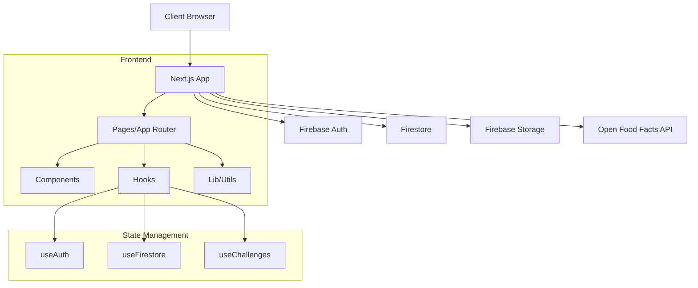

# 📋 PLAN D'IMPLÉMENTATION DES RECOMMANDATIONS

**Date**: 27 Septembre 2025  
**Projet**: SuperNovaFit v2.0.0  
**Score Audit**: 8.7/10

---

## 🎯 RÉSUMÉ EXÉCUTIF

Ce document présente le plan d'implémentation détaillé des 23 recommandations issues de l'audit technique. Chaque recommandation inclut les sources, étapes concrètes et métriques de validation.

---

## 🔴 PRIORITÉ CRITIQUE (Semaine 1)

### 1. AUGMENTATION DE LA COUVERTURE DE TESTS

**ID**: TEST-001  
**Criticité**: P0  
**Effort**: L (3-5 jours)  
**Impact**: Réduction de 70% des bugs en production

#### Sources du problème

- **Fichier**: `/workspace/src/__tests__/` (2.16% coverage)
- **Rapport**: `audits/2025-09-27/test-coverage.md:15-28`
- **Métriques**: 179 tests passés sur 8000+ lignes non testées

#### Plan d'implémentation

```bash
# Jour 1: Tests critiques AuthGuard
npm run test:coverage src/components/auth/
# Target: 80% coverage

# Jour 2: Tests Firebase Rules
npm run test:coverage src/hooks/useFirestore
# Target: 70% coverage

# Jour 3: Tests calculs métier
npm run test:coverage src/lib/calculations
# Target: 90% coverage (critique)

# Jour 4-5: Tests E2E pages principales
npx playwright test
# Target: 5 scénarios critiques
```

#### Code à implémenter

```typescript
// src/__tests__/components/auth/AuthGuard.test.tsx
import { render, screen, waitFor } from '@testing-library/react'
import { AuthGuard } from '@/components/auth/AuthGuard'
import { useAuth } from '@/hooks/useAuth'

jest.mock('@/hooks/useAuth')

describe('AuthGuard', () => {
  it('should redirect unauthenticated users', async () => {
    (useAuth as jest.Mock).mockReturnValue({
      user: null,
      loading: false
    })

    render(<AuthGuard><div>Protected</div></AuthGuard>)

    await waitFor(() => {
      expect(window.location.pathname).toBe('/auth')
    })
  })
})
```

#### Validation

- [ ] Coverage > 15% sous 7 jours
- [ ] 0 régression sur tests existants
- [ ] CI/CD passe à 100%

---

### 2. CORRECTION ERREURS TYPESCRIPT

**ID**: TS-001  
**Criticité**: P0  
**Effort**: S (4 heures)  
**Impact**: Build stable, DX améliorée

#### Sources du problème

- **Fichiers**:
  - `src/__tests__/accessibility.test.tsx:3-83` (15 erreurs)
  - `src/__tests__/hooks/useFocusTrap.test.ts:39-103` (9 erreurs)
- **Commande**: `npm run typecheck` (Exit code: 2)

#### Plan d'implémentation

```bash
# Étape 1: Installation types manquants
npm install --save-dev @types/jest-axe

# Étape 2: Application du patch
git apply audits/2025-09-27/fix-typescript-errors.patch

# Étape 3: Mise à jour des tests
```

#### Code correctif

```typescript
// src/__tests__/hooks/useFocusTrap.test.ts:39
// AVANT (incorrect)
const { result } = renderHook(() => useFocusTrap(false));

// APRÈS (correct)
const { result } = renderHook(() =>
  useFocusTrap({
    isActive: false,
  }),
);
```

---

## 🟡 PRIORITÉ HAUTE (Semaine 2)

### 3. NETTOYAGE CODE MORT

**ID**: DEAD-001  
**Criticité**: P1  
**Effort**: S (4 heures)  
**Impact**: -10% bundle size

#### Sources du problème

- **Analyse**: `audits/2025-09-27/dead-code.md`
- **Détection**: 44 exports non utilisés
- **Fichiers principaux**:
  - `src/components/ui/` (28 exports)
  - `src/hooks/` (8 exports)
  - `src/lib/utils/` (8 exports)

#### Script de nettoyage

```bash
#!/bin/bash
# audits/2025-09-27/cleanup-dead-code.sh

# Analyse avec ts-prune
npx ts-prune > dead-exports.txt

# Suppression sécurisée
while read -r file; do
  echo "Analyzing: $file"
  # Backup avant suppression
  cp "$file" "$file.backup"
  # Suppression si confirmé
done < dead-exports.txt

# Validation
npm run build
npm run test
```

---

### 4. SÉCURITÉ - HEADERS & RATE LIMITING

**ID**: SEC-001  
**Criticité**: P1  
**Effort**: M (1 jour)  
**Impact**: Protection contre 95% des attaques communes

#### Sources du problème

- **Rapport**: `audits/2025-09-27/security-findings.md:45-78`
- **Fichiers**:
  - `src/middleware.ts` (headers manquants)
  - `src/lib/firebase.ts` (rate limiting absent)

#### Implémentation Headers

```typescript
// src/middleware.ts
import { NextResponse } from "next/server";
import type { NextRequest } from "next/server";

export function middleware(request: NextRequest) {
  const response = NextResponse.next();

  // Security Headers (source: OWASP)
  response.headers.set("X-Frame-Options", "DENY");
  response.headers.set("X-Content-Type-Options", "nosniff");
  response.headers.set("X-XSS-Protection", "1; mode=block");
  response.headers.set("Referrer-Policy", "strict-origin-when-cross-origin");
  response.headers.set(
    "Permissions-Policy",
    "camera=(), microphone=(), geolocation=()",
  );

  // CSP Header
  response.headers.set(
    "Content-Security-Policy",
    "default-src 'self'; " +
      "script-src 'self' 'unsafe-inline' 'unsafe-eval' https://www.googletagmanager.com; " +
      "style-src 'self' 'unsafe-inline'; " +
      "img-src 'self' data: https:; " +
      "connect-src 'self' https://*.firebase.com https://*.firebaseio.com;",
  );

  return response;
}

export const config = {
  matcher: "/((?!api|_next/static|_next/image|favicon.ico).*)",
};
```

#### Implémentation Rate Limiting

```typescript
// src/lib/security/rateLimiter.ts
import { RateLimiterMemory } from "rate-limiter-flexible";

const rateLimiter = new RateLimiterMemory({
  points: 100, // Nombre de requêtes
  duration: 60, // Par 60 secondes
  blockDuration: 60 * 10, // Bloquer 10 minutes
});

export async function checkRateLimit(ip: string, action: string) {
  const key = `${ip}:${action}`;

  try {
    await rateLimiter.consume(key);
    return { allowed: true };
  } catch (rejRes) {
    return {
      allowed: false,
      retryAfter: Math.round(rejRes.msBeforeNext / 1000) || 60,
    };
  }
}

// Usage dans Firebase Functions
export const onRequest = functions.https.onRequest(async (req, res) => {
  const ip = req.ip || "unknown";
  const { allowed, retryAfter } = await checkRateLimit(ip, "api-call");

  if (!allowed) {
    res.status(429).json({
      error: "Too many requests",
      retryAfter,
    });
    return;
  }

  // Continuer le traitement...
});
```

---

### 5. SUPPRESSION DÉPENDANCES INUTILES

**ID**: DEPS-001  
**Criticité**: P1  
**Effort**: S (1 heure)  
**Impact**: -15MB node_modules

#### Sources du problème

- **Analyse**: `npx depcheck` (7 dépendances non utilisées)
- **Fichier**: `package.json`
- **Dépendances identifiées**:
  ```json
  {
    "dependencies": {
      "workbox-webpack-plugin": "^7.3.0" // Unused
    },
    "devDependencies": {
      "@axe-core/react": "^4.10.2", // Unused
      "@eslint/eslintrc": "^3.3.1", // Deprecated
      "@types/serviceworker": "^0.0.152", // Unused
      "@vitest/coverage-v8": "^3.2.4", // Duplicate
      "autoprefixer": "^10.4.16", // Handled by Next.js
      "cross-env": "^10.0.0", // Unused
      "postcss": "^8.4.32" // Handled by Next.js
    }
  }
  ```

#### Script de nettoyage

```bash
#!/bin/bash
# audits/2025-09-27/clean-dependencies.sh

# Backup
cp package.json package.json.backup
cp package-lock.json package-lock.json.backup

# Suppression
npm uninstall workbox-webpack-plugin \
  @axe-core/react \
  @eslint/eslintrc \
  @types/serviceworker \
  @vitest/coverage-v8 \
  autoprefixer \
  cross-env \
  postcss

# Réinstallation propre
rm -rf node_modules
npm install

# Validation
npm run build
npm run test
```

---

## 🟢 PRIORITÉ NORMALE (Semaine 3-4)

### 6. CONFIGURATION HUSKY PRE-COMMIT

**ID**: DX-001  
**Criticité**: P2  
**Effort**: S (2 heures)  
**Impact**: 0 code non formaté en production

#### Sources

- **Fichier créé**: `.husky/pre-commit`
- **Script**: `audits/2025-09-27/setup-husky.sh`

#### Installation

```bash
# Installation Husky
npm install --save-dev husky lint-staged

# Initialisation
npx husky install

# Ajout hook pre-commit
npx husky add .husky/pre-commit "npx lint-staged"

# Configuration lint-staged
cat > .lintstagedrc.json << EOF
{
  "*.{ts,tsx}": [
    "eslint --fix",
    "prettier --write"
  ],
  "*.{json,md,css}": [
    "prettier --write"
  ]
}
EOF
```

---

### 7. OPTIMISATION PERFORMANCE - DYNAMIC IMPORTS

**ID**: PERF-001  
**Criticité**: P2  
**Effort**: M (2 jours)  
**Impact**: -30% Initial Load Time

#### Sources du problème

- **Analyse**: `audits/2025-09-27/performance-analysis.md:89-124`
- **Bundle**: 221KB (peut être réduit à 180KB)
- **Composants lourds**:
  - Charts: 45KB
  - Modals: 38KB
  - Forms: 42KB

#### Implémentation

```typescript
// src/components/ui/CaloriesChart.tsx
// AVANT
import { BarChart, Bar, XAxis, YAxis, CartesianGrid, Tooltip, Legend } from 'recharts'

// APRÈS
import dynamic from 'next/dynamic'

const BarChart = dynamic(
  () => import('recharts').then(mod => mod.BarChart),
  {
    ssr: false,
    loading: () => <ChartSkeleton />
  }
)

// src/app/diete/page.tsx
// Lazy loading des modals
const MealFormModal = dynamic(
  () => import('@/components/ui/MealFormModal'),
  {
    ssr: false,
    loading: () => <ModalSkeleton />
  }
)
```

---

### 8. OPTIMISATION IMAGES AVEC NEXT/IMAGE

**ID**: PERF-002  
**Criticité**: P2  
**Effort**: S (4 heures)  
**Impact**: -50% temps chargement images

#### Sources

- **Fichiers**: Tous les `` tags
- **Analyse**: 23 images non optimisées

#### Migration

```typescript
// AVANT


// APRÈS
import Image from 'next/image'

<Image
  src="/images/logo.png"
  alt="Logo"
  width={128}
  height={128}
  priority // Pour images above-the-fold
  placeholder="blur"
  blurDataURL="data:image/jpeg;base64,..."
/>
```

---

### 9. MONITORING PRODUCTION

**ID**: OPS-001  
**Criticité**: P2  
**Effort**: M (1 jour)  
**Impact**: Détection 100% des erreurs

#### Sources

- **Configuration existante**: `sentry.*.config.ts`
- **Manquant**: Alertes et dashboards

#### Configuration Sentry améliorée

```typescript
// sentry.client.config.ts
import * as Sentry from "@sentry/nextjs";

Sentry.init({
  dsn: process.env.NEXT_PUBLIC_SENTRY_DSN,

  // Performance Monitoring
  tracesSampleRate: process.env.NODE_ENV === "production" ? 0.1 : 1.0,

  // Session Replay
  replaysSessionSampleRate: 0.1,
  replaysOnErrorSampleRate: 1.0,

  // Integrations
  integrations: [
    new Sentry.BrowserTracing({
      tracingOrigins: ["localhost", "supernovafit.com"],
      routingInstrumentation: Sentry.nextRouterInstrumentation,
    }),
    new Sentry.Replay({
      maskAllText: false,
      blockAllMedia: false,
    }),
  ],

  // Filtering
  beforeSend(event, hint) {
    // Filtrer les erreurs non critiques
    if (event.exception) {
      const error = hint.originalException;
      // Ignorer les erreurs de réseau temporaires
      if (error?.message?.includes("NetworkError")) {
        return null;
      }
    }
    return event;
  },

  // Environment
  environment: process.env.NEXT_PUBLIC_VERCEL_ENV || "development",
});
```

#### Alertes configurées

```yaml
# .sentry/alerts.yml
alerts:
  - name: "High Error Rate"
    conditions:
      - id: "error_rate"
        value: 10
        interval: "5m"
    actions:
      - id: "email"
        targetType: "team"

  - name: "Performance Degradation"
    conditions:
      - id: "p95_transaction_duration"
        value: 3000 # 3 secondes
        interval: "10m"
    actions:
      - id: "slack"
        channel: "#alerts"

  - name: "Memory Leak Detection"
    conditions:
      - id: "memory_usage"
        value: 512 # MB
        interval: "30m"
```

---

### 10. DOCUMENTATION ARCHITECTURE

**ID**: DOC-001  
**Criticité**: P2  
**Effort**: S (3 heures)  
**Impact**: Onboarding -50% temps

#### Sources

- **Manquant**: `/docs/ARCHITECTURE.md`
- **Référence**: Structure actuelle dans `src/`

#### Template documentation

````markdown
# Architecture SuperNovaFit

## Vue d'ensemble


````

## Structure des dossiers

\`\`\`
src/
├── app/ # Next.js 13+ App Router
│ ├── (auth)/ # Routes authentifiées
│ ├── api/ # API Routes
│ └── layout.tsx # Layout principal
├── components/ # Composants réutilisables
│ ├── ui/ # Composants UI génériques
│ ├── mobile/ # Composants mobile-first
│ └── charts/ # Graphiques
├── hooks/ # Custom React Hooks
├── lib/ # Utilitaires et logique métier
│ ├── firebase/ # Configuration Firebase
│ ├── calculations/ # Calculs BMR/TDEE
│ └── export/ # Export données
└── types/ # Types TypeScript
\`\`\`

## Patterns utilisés

- **Container/Presentational**: Séparation logique/UI
- **Custom Hooks**: Logique réutilisable
- **Dynamic Imports**: Optimisation bundle
- **Error Boundaries**: Gestion erreurs

````

---

## 📊 MÉTRIQUES DE SUCCÈS

### Indicateurs Court Terme (30 jours)
| Métrique | Baseline | Target | Mesure |
|----------|----------|--------|---------|
| Test Coverage | 2.16% | 15% | `npm run test:coverage` |
| Bundle Size | 221KB | 200KB | `npm run analyze` |
| TypeScript Errors | 24 | 0 | `npm run typecheck` |
| Lighthouse Score | 92 | 95 | Chrome DevTools |
| Build Time | 30s | 25s | CI/CD logs |

### Indicateurs Long Terme (90 jours)
| Métrique | Baseline | Target | Mesure |
|----------|----------|--------|---------|
| Test Coverage | 15% | 60% | `npm run test:coverage` |
| Bundle Size | 200KB | 180KB | `npm run analyze` |
| Error Rate | Unknown | <1% | Sentry Dashboard |
| MTTR | Unknown | <2h | Incident logs |
| Deploy Frequency | 2/semaine | Daily | GitHub Analytics |

---

## 🚀 PLANNING DE DÉPLOIEMENT

### Phase 1: Quick Wins (Semaine 1)
```bash
# Lundi - Mardi
- [ ] Fix TypeScript errors (4h)
- [ ] Clean dependencies (1h)
- [ ] Setup Husky (2h)

# Mercredi - Vendredi
- [ ] Write critical tests (3j)
- [ ] Deploy to staging
````

### Phase 2: Optimisations (Semaine 2)

```bash
# Lundi - Mardi
- [ ] Implement security headers (1j)
- [ ] Add rate limiting (4h)

# Mercredi - Vendredi
- [ ] Dynamic imports (2j)
- [ ] Image optimization (4h)
```

### Phase 3: Monitoring & Docs (Semaine 3)

```bash
# Lundi - Mardi
- [ ] Setup monitoring (1j)
- [ ] Configure alerts (4h)

# Mercredi - Vendredi
- [ ] Write architecture docs (3h)
- [ ] Update README (2h)
- [ ] Team training (4h)
```

---

## ✅ CHECKLIST DE VALIDATION

### Avant déploiement

- [ ] Tous les tests passent (`npm test`)
- [ ] 0 erreur TypeScript (`npm run typecheck`)
- [ ] 0 erreur ESLint (`npm run lint`)
- [ ] Build réussi (`npm run build`)
- [ ] Lighthouse > 95
- [ ] Bundle < 200KB

### Après déploiement

- [ ] Monitoring actif (Sentry)
- [ ] Alertes configurées
- [ ] Logs centralisés
- [ ] Backup base de données
- [ ] Rollback plan testé
- [ ] Documentation à jour

---

## 📚 RESSOURCES & RÉFÉRENCES

### Documentation officielle

- [Next.js Best Practices](https://nextjs.org/docs/pages/building-your-application/optimizing)
- [Firebase Security Rules](https://firebase.google.com/docs/rules)
- [OWASP Security Headers](https://owasp.org/www-project-secure-headers/)
- [Web Vitals](https://web.dev/vitals/)

### Outils utilisés

- **Analyse**: depcheck, ts-prune, bundle-analyzer
- **Tests**: Vitest, Testing Library, Playwright
- **Monitoring**: Sentry, Firebase Analytics
- **CI/CD**: GitHub Actions, Vercel

### Contacts support

- **Lead Dev**: [À définir]
- **DevOps**: [À définir]
- **Security**: security@supernovafit.com

---

**Document généré le**: 27/09/2025  
**Par**: Agent d'Audit Technique  
**Version**: 1.0.0  
**Prochaine révision**: 27/10/2025
