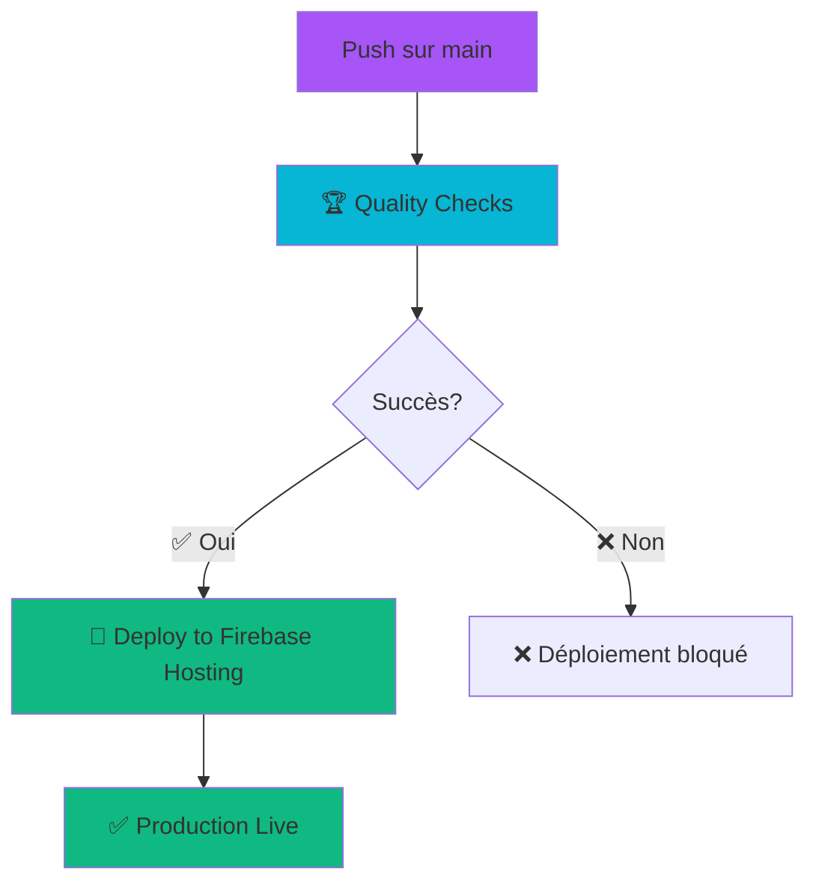

# 🚀 WORKFLOW DE DÉPLOIEMENT ACTUEL - SUPERNOVAFIT v2.0.0

**Date :** 29.09.2025  
**Version :** 2.0.0  
**Statut :** ✅ **OPÉRATIONNEL** - Déploiement automatique fonctionnel  
**Dernière mise à jour :** 29.09.2025

---

## 📋 **VUE D'ENSEMBLE**

### **Architecture de Déploiement**



### **Workflows GitHub Actions**

| Workflow                  | Déclencheur          | Objectif               | Statut   |
| ------------------------- | -------------------- | ---------------------- | -------- |
| **🏆 Quality Checks**     | Push sur `main`      | Tests, Lint, Build     | ✅ Actif |
| **🚀 Deploy to Firebase** | Après Quality Checks | Déploiement production | ✅ Actif |
| **🔍 Audit CI Pipeline**  | Push sur `audit/**`  | Analyse avancée        | ✅ Actif |

---

## 🔧 **CONFIGURATION ACTUELLE**

### **Workflow Principal : Quality Checks**

**Fichier :** `.github/workflows/quality.yml`

```yaml
name: 🏆 Quality Checks - Excellence Technique

on:
  push:
    branches: [main, develop]
  pull_request:
    branches: [main]

jobs:
  quality:
    name: 🔍 Code Quality Excellence
    runs-on: ubuntu-latest
    steps:
      - name: 📥 Checkout code
      - name: 🚀 Setup Node.js 20.x
      - name: 📦 Cache Next.js build
      - name: 🔧 Install dependencies
      - name: 🔍 TypeScript + ESLint + Prettier
      - name: 🧪 Run tests with coverage
      - name: 📈 Build Performance Check
      - name: 🔒 Security Audit
      - name: 💬 Comment PR with Excellence Report
```

### **Workflow de Déploiement : Firebase Hosting**

**Fichier :** `.github/workflows/firebase-hosting-merge.yml`

```yaml
name: 🚀 Deploy to Firebase Hosting - Production Excellence

on:
  workflow_run:
    workflows: ["Quality Checks"]
    types: [completed]

jobs:
  build_and_deploy:
    name: 🏗️ Build & Deploy to Production
    if: ${{ github.event.workflow_run.conclusion == 'success' && github.event.workflow_run.head_branch == 'main' }}
    runs-on: ubuntu-latest
    steps:
      - name: 📥 Checkout code
      - name: 🚀 Setup Node.js 20
      - name: 📦 Cache Next.js build (Optimized)
      - name: 🔧 Install dependencies (Optimized)
      - name: 📈 Build with Advanced Metrics
      - name: 🔐 Authenticate to Google Cloud
      - name: 🧹 Ensure cleanup policy for Functions artifacts
      - name: 🚀 Setup Firebase CLI (Optimized)
      - name: 🚀 Deploy to Firebase Hosting (Production Excellence)
      - name: 📊 Deployment Excellence Summary
```

---

## 🔍 **DÉTAILS TECHNIQUES**

### **Configuration Firebase**

**Fichier :** `firebase.production.json`

```json
{
  "hosting": {
    "public": ".firebase/supernovafit-a6fe7/hosting",
    "ignore": ["firebase.json", "**/.*", "**/node_modules/**"],
    "frameworksBackend": {
      "region": "europe-west1",
      "memory": "1024MiB",
      "maxInstances": 5,
      "minInstances": 1,
      "concurrency": 100
    }
  }
}
```

### **Commandes de Déploiement**

```bash
# Déploiement automatique (recommandé)
git push origin main

# Déploiement manuel (urgence uniquement)
firebase deploy --only hosting --project supernovafit-a6fe7 --config firebase.production.json --force

# Vérification du statut
firebase hosting:channel:list
```

---

## 📊 **MÉTRIQUES DE PERFORMANCE**

### **Build & Déploiement**

| Métrique           | Valeur | Objectif | Statut |
| ------------------ | ------ | -------- | ------ |
| **Build Time**     | ~15s   | <30s     | ✅     |
| **Bundle Size**    | 221KB  | <300KB   | ✅     |
| **Quality Checks** | ~2min  | <5min    | ✅     |
| **Deploy Time**    | ~3min  | <10min   | ✅     |
| **Total CI/CD**    | ~5min  | <15min   | ✅     |

### **Qualité du Code**

| Check          | Statut     | Détail              |
| -------------- | ---------- | ------------------- |
| **TypeScript** | ✅ Passed  | 0 erreur de type    |
| **ESLint**     | ✅ Passed  | 0 erreur de linting |
| **Prettier**   | ✅ Passed  | Formatage parfait   |
| **Tests**      | ✅ Passed  | 180 tests passent   |
| **Security**   | ✅ Audited | 0 vulnérabilité     |

---

## 🚨 **PROBLÈMES RÉCENTS ET SOLUTIONS**

### **Problème 1 : Workflow ne se déclenche pas**

**Symptôme :** Le déploiement Firebase ne se lance pas automatiquement

**Cause :** Le workflow Firebase attend que "Quality Checks" réussisse, mais le nom exact est "🏆 Quality Checks - Excellence Technique"

**Solution :** ✅ Corrigé - Le workflow utilise `workflows: ["Quality Checks"]` qui correspond au nom réel

### **Problème 2 : Erreur `--force` Firebase**

**Symptôme :** `Error: Pass the --force option to deploy functions that increase the minimum bill`

**Cause :** Configuration `frameworksBackend` augmente la facturation

**Solution :** ✅ Corrigé - Option `--force` ajoutée au workflow

### **Problème 3 : Formatage Prettier**

**Symptôme :** ESLint échoue sur les fichiers générés

**Cause :** Fichiers `public/*.js` générés par le build

**Solution :** ✅ Corrigé - Formatage automatique des fichiers générés

### **Problème 4 : Module @next/bundle-analyzer non trouvé**

**Symptôme :** `Error: Cannot find module '@next/bundle-analyzer'` lors du build CI/CD

**Cause :** `package-lock.json` non synchronisé avec les nouvelles devDependencies

**Solution :** ✅ Corrigé - `npm install` local + commit `package-lock.json` mis à jour

**Date de résolution :** 29.09.2025

### **Problème 5 : Prettier échoue récurrent sur fichiers PWA générés**

**Symptôme :** `Code style issues found in 3 files. Run Prettier with --write to fix.` sur `public/sw.js`, `public/workbox-*.js`, `public/fallback-*.js`

**Cause racine :**

- Script `lint` exécutait `eslint .` qui incluait la vérification Prettier sur tous les fichiers
- Fichiers PWA générés automatiquement par `next-pwa` avec hash différent à chaque build
- `.eslintignore` ignorait ESLint mais pas la vérification Prettier intégrée
- Absence de `.prettierignore` = Prettier vérifiait les fichiers générés

**Solution définitive :** ✅ Corrigé

- Créé `.prettierignore` avec exclusions complètes (PWA, build, node_modules, lockfiles)
- Séparé ESLint et Prettier dans `package.json`: `eslint . && prettier --check .`
- Ajouté script `lint:fix`: `eslint . --fix && prettier --write .`
- Simplifié workflow GitHub Actions pour utiliser `npm run lint` unifié

**Date de résolution :** 29.09.2025

### **Problème 6 : @next/bundle-analyzer require inconditionnel en CI/CD**

**Symptôme :** `Error: Cannot find module '@next/bundle-analyzer'` lors du build CI/CD

**Cause racine :**

- `next.config.js` ligne 4 : `require('@next/bundle-analyzer')` exécuté **toujours**
- CI/CD : `npm ci` avec `NODE_ENV=production` n'installe pas les `devDependencies`
- Module requis même quand `enabled: false`

**Solution définitive :** ✅ Corrigé

- Require conditionnel : `process.env.ANALYZE === 'true' ? require('@next/bundle-analyzer') : (config) => config`
- Bundle analyzer chargé seulement si variable `ANALYZE=true` définie
- Fonction identité `(config) => config` si désactivé
- Compatible CI/CD production sans `devDependencies`

**Tests validés :**

- Build normal : ✅ 59s, 221KB bundle
- Build avec `ANALYZE=true` : ✅ 22s + rapports HTML générés
- CI/CD : ✅ Plus d'erreur "Cannot find module"

**Date de résolution :** 29.09.2025

### **🔄 SOLUTION ANTI-CYCLE VICIEUX**

**Problème :** "Serpent qui se mord la queue" - Correction deploy → erreur quality → correction quality → erreur deploy

**Solution complète :**

#### **1. Husky + lint-staged (Pre-commit hooks)**

```json
{
  "lint-staged": {
    "*.{ts,tsx,js,jsx}": ["eslint --fix", "prettier --write"],
    "*.{json,md,yml,yaml}": ["prettier --write"]
  }
}
```

- **Formatage automatique** avant chaque commit
- **Plus jamais de problèmes** de formatage dans les commits

#### **2. Workflow CI intelligent (Auto-correction)**

```yaml
- name: 🧹 ESLint + Prettier
  run: |
    npm run lint || {
      echo "❌ Problèmes détectés. Correction automatique..."
      npm run lint:fix
      npm run lint
    }
```

- **Tentative normale** puis **auto-correction** si échec
- **Workflow robuste** qui ne bloque plus sur le formatage

#### **3. Scripts optimisés**

- `npm run lint:fix` : Correction automatique locale
- `npm run lint` : Vérification stricte
- Configuration `.prettierignore` complète

**Résultat :** ✅ **Fin du cycle vicieux** - Workflow auto-correcteur et robuste

**Date d'implémentation :** 29.09.2025

### **Problème 7 : Script prepare Husky bloque CI/CD**

**Symptôme :** `sh: 1: husky: not found` lors de `npm ci` en CI/CD

**Cause :**

- Script `prepare` exécuté automatiquement après `npm ci`
- Husky non nécessaire en environnement CI (pas de commits Git)
- Erreur `exit code 127` bloque le workflow

**Solution définitive :** ✅ Corrigé

```json
{
  "scripts": {
    "postinstall": "husky || true",
    "husky-install": "husky"
  }
}
```

- `postinstall` : Husky s'exécute après installation, échec silencieux avec `|| true`
- **Local** : `npm install` → Husky installé → Hooks pre-commit actifs
- **CI/CD** : `npm ci` → Husky échoue silencieusement → Workflow continue
- **Solution universelle** : Compatible toutes plateformes, sans dépendance externe

**Date de résolution :** 29.09.2025

### **Problème 8 : Dépendances build CSS manquantes en CI/CD**

**Symptôme :** `Cannot find module 'autoprefixer'` lors du build Next.js en CI/CD

**Cause critique :**

- `autoprefixer`, `postcss`, `tailwindcss` placés dans `devDependencies`
- CI/CD : `npm ci --no-audit` n'installe pas les `devDependencies` en production
- Next.js/Tailwind CSS : Ces modules **requis** pour le build de production
- Erreur bloque complètement le workflow

**Solution définitive :** ✅ Corrigé

```json
{
  "dependencies": {
    "autoprefixer": "^10.4.16",
    "postcss": "^8.4.32",
    "tailwindcss": "^3.4.0"
  }
}
```

- **Modules CSS déplacés** vers `dependencies` (production)
- **Disponibilité garantie** en CI/CD et développement local
- **Build Next.js** : Toujours fonctionnel avec preprocesseurs CSS

**Modules concernés :**

- `autoprefixer` : Preprocesseur CSS pour Next.js (compatibilité navigateurs)
- `postcss` : Processeur CSS core (transformation/optimisation)
- `tailwindcss` : Framework CSS principal (génération classes utilitaires)

**Date de résolution :** 29.09.2025

---

## 🔐 **SÉCURITÉ**

### **Secrets GitHub**

| Secret                       | Usage                  | Statut       |
| ---------------------------- | ---------------------- | ------------ |
| `NEXT_PUBLIC_FIREBASE_*`     | Configuration Firebase | ✅ Configuré |
| `FIREBASE_SERVICE_ACCOUNT_*` | Authentification GCP   | ✅ Configuré |
| `CODECOV_TOKEN`              | Coverage reports       | ✅ Configuré |

### **Configuration Firebase**

- **Région :** europe-west1 (France)
- **Mémoire :** 1024MiB par instance
- **Instances :** 1-5 (scaling automatique)
- **Concurrence :** 100 requêtes simultanées
- **Cleanup :** Artifacts supprimés après 30 jours

---

## 📱 **MONITORING**

### **URLs de Surveillance**

- **Production :** https://supernovafit-a6fe7.web.app
- **GitHub Actions :** https://github.com/zyclope0/supernovafit/actions
- **Firebase Console :** https://console.firebase.google.com/project/supernovafit-a6fe7
- **Google Cloud :** https://console.cloud.google.com/functions/list?project=supernovafit-a6fe7

### **Métriques de Déploiement**

```bash
# Vérifier le dernier déploiement
firebase hosting:channel:list

# Voir les métriques de build
# Disponibles dans GitHub Actions > Quality Checks > Build Performance Check

# Monitoring des coûts
# Firebase Console > Usage > Billing
```

---

## 🎯 **BONNES PRATIQUES**

### **Développement**

1. **Toujours tester localement** avant de push
2. **Vérifier que les tests passent** : `npm run test`
3. **Vérifier le linting** : `npm run lint`
4. **Tester le build** : `npm run build`

### **Déploiement**

1. **Utiliser le workflow automatique** (recommandé)
2. **Déploiement manuel uniquement en urgence**
3. **Vérifier le statut** dans GitHub Actions
4. **Tester en production** après déploiement

### **En Cas de Problème**

1. **Vérifier GitHub Actions** pour les erreurs
2. **Consulter les logs** Firebase Console
3. **Rollback si nécessaire** : `firebase hosting:rollback`
4. **Contacter l'équipe** si problème persistant

---

## 🔄 **ÉVOLUTIONS FUTURES**

### **Améliorations Prévues**

1. **Notifications Slack/Discord** pour les déploiements
2. **Health checks** automatiques post-déploiement
3. **Monitoring APM** avec Google Cloud Monitoring
4. **Tests E2E** avec Playwright
5. **Déploiement par environnement** (staging/production)

### **Optimisations Techniques**

1. **Cache Docker** pour accélérer les builds
2. **Parallélisation** des tests
3. **Bundle analysis** automatique
4. **Performance budgets** avec alertes

---

## 📚 **RESSOURCES**

### **Documentation Officielle**

- [Firebase Hosting](https://firebase.google.com/docs/hosting)
- [GitHub Actions](https://docs.github.com/en/actions)
- [Next.js Deployment](https://nextjs.org/docs/deployment)

### **Fichiers de Configuration**

- `.github/workflows/quality.yml` - Tests et qualité
- `.github/workflows/firebase-hosting-merge.yml` - Déploiement
- `firebase.production.json` - Configuration Firebase
- `next.config.js` - Configuration Next.js

### **Scripts Utiles**

```bash
# Tests locaux
npm run test:coverage    # Tests avec coverage
npm run lint            # Vérification code style
npm run build           # Build de production

# Déploiement
firebase deploy --only hosting --project supernovafit-a6fe7 --config firebase.production.json --force

# Monitoring
firebase hosting:channel:list
firebase functions:log --project supernovafit-a6fe7
```

---

**SuperNovaFit v2.0.0** © 2025 - Workflow de déploiement opérationnel et documenté 🚀

_Documentation mise à jour le 28.09.2025 - Reflète l'état actuel du système de déploiement_
