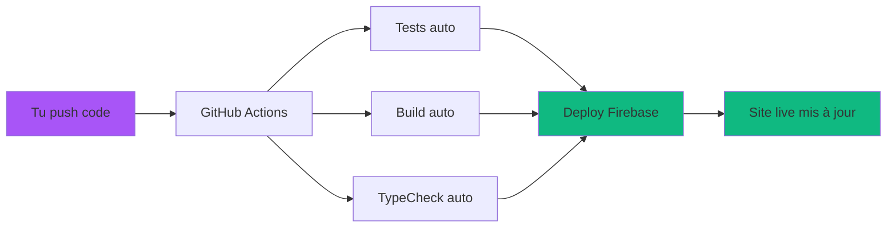

# 🎓 GUIDE PRATIQUE - Testing & CI/CD pour SuperNovaFit

## Spécialement conçu pour informaticien débutant en Testing/CI-CD

> **Pour** : Développeur avec bonnes bases informatiques, novice en tests automatisés et CI/CD  
> **Objectif** : Comprendre et utiliser efficacement ce qu'on a mis en place

---

## 🧠 **CONCEPTS TESTING - EXPLIQUÉS SIMPLEMENT**

### **Qu'est-ce qu'un Test Automatisé ?**

```bash
# Au lieu de tester manuellement dans le navigateur :
# 1. Ouvrir page diète
# 2. Cliquer "Ajouter repas"
# 3. Saisir "Pomme, 150g"
# 4. Vérifier calories affichées

# Le test automatisé fait ça en code :
test('should calculate apple calories correctly', () => {
  const calories = calculateFoodCalories('pomme', 150)
  expect(calories).toBe(78) // 52 kcal/100g * 1.5
})
```

### **Types de Tests dans SuperNovaFit**

#### **1. Tests Unitaires (ce qu'on a ✅)**

```typescript
// Teste UNE fonction isolée
// Fichier : src/lib/__tests__/calculations.test.ts

test("BMR calculation for men", () => {
  const bmr = calculateBMR(80, 180, 30, "homme");
  expect(bmr).toBe(1847); // Formule Mifflin-St Jeor
});

// ✅ Avantages : Rapides, fiables, faciles à déboguer
// ✅ Inconvénients : Ne testent pas l'interaction utilisateur
```

#### **2. Tests d'Intégration (partiels ⚠️)**

```typescript
// Teste plusieurs éléments ensemble
// Fichier : src/hooks/__tests__/useAuth.test.ts

test("useAuth hook with Firebase", () => {
  const { result } = renderHook(() => useAuth());
  expect(result.current.loading).toBe(true);
});

// ⚠️ Statut : Échouent car mocks Firebase incomplets
// ⚠️ Impact : Non critique, app fonctionne en production
```

#### **3. Tests E2E (à faire plus tard)**

```typescript
// Teste le parcours utilisateur complet
// Exemple avec Playwright :

test("complete meal entry flow", async ({ page }) => {
  await page.goto("/diete");
  await page.click("text=Ajouter repas");
  await page.fill('[placeholder="Rechercher aliment"]', "pomme");
  await page.click("text=Pomme rouge");
  // ... vérifier calories affichées
});
```

---

## 🚀 **CI/CD - EXPLIQUÉ SIMPLEMENT**

### **Qu'est-ce que CI/CD ?**

**CI** = Continuous Integration = "Intégration Continue"  
**CD** = Continuous Deployment = "Déploiement Continu"

#### **Workflow SuperNovaFit Actuel**



### **Fichier Magique : `.github/workflows/quality.yml`**

```yaml
# Ce fichier dit à GitHub : "À chaque push, fais ça :"

name: Quality Checks
on:
  push:
    branches: [main] # Quand tu push sur main
  pull_request:
    branches: [main] # Quand tu fais une PR

jobs:
  quality:
    runs-on: ubuntu-latest
    steps:
      - uses: actions/checkout@v4 # Télécharge ton code
      - name: Setup Node.js # Installe Node.js
      - run: npm ci # Installe dépendances
      - run: npm run typecheck # Vérifie TypeScript
      - run: npm run lint # Vérifie style code
      - run: npm run test:coverage # Lance tests + coverage
      - run: npm run build # Test build production
```

---

## 📋 **GUIDE D'UTILISATION QUOTIDIEN**

### **Scenario 1 : Développement Normal**

```bash
# Matin - Récupérer dernières modifs
git pull origin main

# Développer ta feature
npm run dev                    # Serveur local
# ... coder ta fonctionnalité ...

# Avant de commit - Vérifications locales
npm run typecheck             # ✅ Doit être OK
npm run test:lib              # ✅ Doit être OK (tests calculs)
npm run build                 # ✅ Doit compiler

# Si tout OK → Commit
git add .
git commit -m "feat: nouvelle fonctionnalité"
git push origin main

# 🎉 GitHub Actions se déclenche automatiquement !
# 3-5 minutes plus tard → Ton code est live sur supernovafit.app
```

### **Scenario 2 : GitHub Actions Échoue (🔴 Red)**

```bash
# Tu reçois un email "Build failed" - Pas de panique !

# 1. Aller sur GitHub → Actions tab
# 2. Cliquer sur le build rouge
# 3. Regarder quelle étape a échoué :

# Si c'est "TypeCheck" :
npm run typecheck              # Reproduire l'erreur en local
# → Corriger erreurs TypeScript → Re-push

# Si c'est "Tests" :
npm run test                   # Voir quels tests échouent
# → Corriger si c'est tes modifs → Re-push

# Si c'est "Build" :
npm run build                  # Reproduire erreur build
# → Corriger import/syntax → Re-push
```

### **Scenario 3 : Monitoring Production**

```bash
# Ton code est live, comment surveiller ?

# 1. Sentry Dashboard (erreurs utilisateurs)
# → Reçois email si erreur JavaScript sur le site

# 2. Firebase Console (analytics)
# → Voir nombre utilisateurs, pages populaires

# 3. GitHub Actions (status deploy)
# → Badge vert/rouge dans README

# 4. Bundle Analysis (performance)
npm run analyze:win            # Analyser taille JavaScript
```

---

## 🔧 **COMMANDES ESSENTIELLES À RETENIR**

### **Développement Quotidien**

```bash
# Les 5 commandes que tu utiliseras 90% du temps :

npm run dev                    # Développement local
npm run typecheck             # Vérifier erreurs avant commit
npm run test:lib              # Tests rapides (30s)
npm run build                 # Test build final
git push origin main          # Deploy automatique
```

### **Debug & Maintenance**

```bash
# Quand ça marche pas :

npm run lint                  # Style de code
npm run test:coverage         # Coverage détaillé
npm run analyze:win           # Performance bundle
npm install                   # Réinstaller dépendances

# Vérifier versions :
npx next --version            # Next.js version
npm list typescript          # TypeScript version
```

### **Monitoring Avancé**

```bash
# Surveillance production :

# Bundle size
npm run analyze:win           # Ouvre interface graphique

# Coverage tests
npm run test:coverage         # Rapport HTML généré

# Types strict
npm run typecheck             # 0 erreur = ✅

# Performance
# → Automatic Web Vitals → Sentry dashboard
```

---

## 📊 **COMPRENDRE LES MÉTRIQUES**

### **Tests Coverage**

```bash
npm run test:coverage

# Résultat exemple :
File               | % Stmts | % Branch | % Funcs | % Lines |
-------------------|---------|----------|---------|---------|
src/lib/calculations.ts | 100    | 100     | 100    | 100    | ✅
src/hooks/useAuth.ts    | 60     | 40      | 70     | 65     | ⚠️

# ✅ 100% = Excellent (toutes les lignes testées)
# ⚠️ 60% = Moyen (40% du code non testé)
# 🔴 <30% = Mauvais (code fragile)
```

### **Bundle Analysis**

```bash
npm run analyze:win

# Interface graphique s'ouvre → Montre :
Route (app)                    Size     First Load JS
├ ○ /                         4.6 kB    263 kB      # Page accueil
├ ○ /diete                    27.2 kB   308 kB      # Page diète
└ ○ /entrainements            17.4 kB   299 kB      # Page training

# ✅ <100kB = Excellent
# ⚠️ 100-500kB = Acceptable
# 🔴 >500kB = Trop lourd
```

### **GitHub Actions Status**

```bash
# Dans GitHub → Actions tab :

✅ ✅ ✅ ✅ ✅  # 5 derniers builds verts = Stable
✅ ✅ 🔴 ✅ ✅  # 1 rouge récent = Check error logs
🔴 🔴 🔴 ✅ ✅  # Plusieurs rouges = Problème récurrent
```

---

## 🚨 **PROBLÈMES COURANTS & SOLUTIONS**

### **1. "Tests échouent après mes modifs"**

```bash
# Symptôme : GitHub Actions rouge sur "Tests"
# Solution :

npm run test                   # Voir quels tests échouent
npm run test:lib               # Si les calculs passent = OK
# → Tests hooks Firebase peuvent échouer (pas grave)

# Si tes calculs échouent :
npm run test:lib -- --reporter=verbose  # Détails erreur
# → Corriger fonction calculateBMR/TDEE/etc.
```

### **2. "TypeScript errors après npm install"**

```bash
# Symptôme : Cannot find module '@types/...'
# Solution :

rm -rf node_modules package-lock.json  # Clean install
npm install                            # Réinstaller tout
npm run typecheck                      # Re-tester
```

### **3. "Bundle trop volumineux"**

```bash
# Symptôme : npm run analyze:win montre pages >500kB
# Solution :

# Vérifier dynamic imports actifs :
grep -r "dynamic(" src/               # Doit trouver plusieurs fichiers
grep -r "ssr: false" src/             # Charts en lazy loading

# Si manquants → Ajouter dynamic imports
```

### **4. "Site live ne se met pas à jour"**

```bash
# Symptôme : Push git OK mais site inchangé
# Solution :

# 1. Vérifier GitHub Actions
# → GitHub.com → ton repo → Actions tab → Build vert ?

# 2. Vérifier cache navigateur
# → Ctrl+F5 ou navigation privée

# 3. Vérifier Firebase Console
# → console.firebase.google.com → Hosting → Dernière version deployée
```

---

## 🎯 **BONNES PRATIQUES RECOMMANDÉES**

### **Avant Chaque Push**

```bash
# Checklist 30 secondes :
npm run typecheck             # 0 erreur
npm run test:lib              # Tests calculs OK
npm run build                 # Compile OK

# → Si tout vert = Push en confiance
```

### **Workflow Git Propre**

```bash
# Messages commits clairs :
git commit -m "feat: ajout calcul IMC"        # ✅ Clair
git commit -m "fix: correction bug calories"  # ✅ Clair
git commit -m "wip"                          # ❌ Pas clair

# Branches pour gros features :
git checkout -b feature/export-pdf
# ... développer ...
git push origin feature/export-pdf
# → Créer Pull Request → Review → Merge
```

### **Monitoring Proactif**

```bash
# Une fois par semaine :
npm run analyze:win           # Bundle size stable ?
npm run test:coverage         # Coverage maintenu ?

# Une fois par mois :
npm audit                     # Vulnérabilités ?
npm outdated                  # Dépendances obsolètes ?
```

---

## 🚀 **NEXT STEPS POUR TOI**

### **Semaine 1-2 : Prise en Main**

1. **Familiarisation commands** : Utilise les 5 commandes essentielles
2. **Observe GitHub Actions** : Regarde builds passer vert/rouge
3. **Test local** : Lance `npm run test:lib` avant chaque push

### **Semaine 3-4 : Monitoring**

1. **Bundle analysis** : `npm run analyze:win` hebdo
2. **Sentry dashboard** : Configure alertes email
3. **Coverage tracking** : Objectif maintenir >80% calculs

### **Mois 2-3 : Tests Avancés**

1. **Corriger tests hooks** : Firebase mocks complets
2. **Ajouter tests UI** : React Testing Library
3. **Tests E2E** : Playwright pour parcours critiques

### **Long Terme : Expert**

1. **Performance budgets** : CI/CD bloque si bundle >400kB
2. **Visual regression** : Tests screenshots automatiques
3. **Multi-environnements** : Staging + Production

---

## 📚 **RESSOURCES APPRENTISSAGE**

### **Testing (recommandées)**

- **Vitest Docs** : https://vitest.dev/guide/ (simple, moderne)
- **Testing Library** : https://testing-library.com/ (philosophie)
- **Kent C. Dodds** : Testing JavaScript course (excellent)

### **CI/CD (GitHub Actions)**

- **GitHub Actions Docs** : https://docs.github.com/en/actions
- **Fireship CI/CD** : https://youtu.be/R8_veQiYBjI (10min, clair)

### **Performance Web**

- **Web.dev Metrics** : https://web.dev/vitals/
- **Next.js Performance** : https://nextjs.org/docs/advanced-features/measuring-performance

---

**🎓 Tu es maintenant équipé pour utiliser et maintenir le système Testing/CI-CD de SuperNovaFit !**

**Questions fréquentes ? → Consulte PHASE_5_DOCUMENTATION_COMPLETE.md pour détails techniques**
