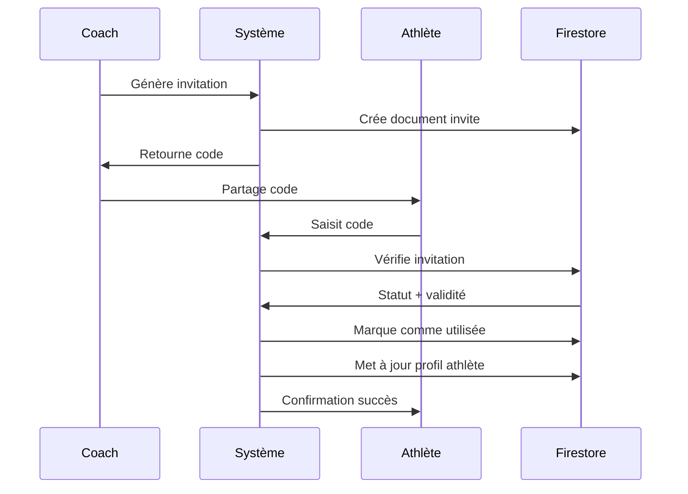

# 🤝 Système d'Invitations Coach-Athlète

## 📋 Vue d'ensemble

Le système d'invitations permet aux coachs de générer des codes d'invitation sécurisés pour lier des athlètes à leur compte. Les athlètes peuvent ensuite utiliser ces codes pour rejoindre automatiquement leur coach.

## 🎯 Fonctionnalités

### ✅ **Implémenté**
- **Génération de codes** : 6 caractères A-Z/2-9 (sans O/0/I/1)
- **TTL 72h** : Expiration automatique
- **Usage unique** : Chaque code ne peut être utilisé qu'une fois
- **Rate limiting** : 5 générations / 10 min / coach
- **Interface coach** : Modal complet avec gestion
- **Interface athlète** : Composant de saisie avec validation
- **Sécurité** : Règles Firestore appropriées
- **Analytics** : Tracking des événements

## 🏗️ Architecture

### Types TypeScript
```typescript
// Types pour les invitations
export type InviteStatus = 'active' | 'used' | 'revoked';

export interface Invite {
  code: string; // Code à 6 caractères
  coachId: string; // ID du coach
  createdAt: Date;
  expiresAt: Date; // TTL 72h
  status: InviteStatus;
  usedByAthleteId?: string; // ID de l'athlète qui a utilisé le code
  usedAt?: Date;
  revokedAt?: Date;
}

// Extension du type User
export interface User {
  // ... autres champs
  ownerCoachId?: string; // ID du coach propriétaire (v1 mono-coach)
}
```

### Structure Firestore
```
invites/{code}
├── code: string (6 caractères)
├── coachId: string
├── createdAt: timestamp
├── expiresAt: timestamp
├── status: 'active' | 'used' | 'revoked'
├── usedByAthleteId?: string
├── usedAt?: timestamp
└── revokedAt?: timestamp
```

## 🔧 Implémentation

### 1. Utilitaires (`src/lib/inviteUtils.ts`)
```typescript
// Génération de code
export function generateInviteCode(): string

// Validation de format
export function validateInviteCode(code: string): boolean

// Calcul d'expiration
export function calculateExpirationDate(): Date

// Vérifications
export function isInviteExpired(invite: Invite): boolean
export function canUseInvite(invite: Invite): boolean
```

### 2. Hooks Firestore (`src/hooks/useInvites.ts`)
```typescript
// Hook coach
export function useCoachInvites(coachId: string) {
  const { invites, loading, generating, generateInvite, revokeInvite }
}

// Hook athlète
export function useInviteClaim() {
  const { claiming, claimInvite }
}
```

### 3. Composants UI
- **`InviteModal.tsx`** : Modal pour générer/gérer les invitations (côté coach)
- **`InviteCodeInput.tsx`** : Composant de saisie de code (côté athlète)

## 🔐 Sécurité

### Règles Firestore
```javascript
// Collection 'invites'
match /invites/{inviteId} {
  // Création : coachs uniquement
  allow create: if isAuthenticated() && 
    get(/databases/$(database)/documents/users/$(request.auth.uid)).data.role == 'coach' &&
    request.resource.data.coachId == request.auth.uid;
  
  // Lecture : invitations actives uniquement
  allow read: if isAuthenticated() && 
    resource.data.status == 'active';
  
  // Mise à jour :
  // - Coach : peut révoquer ses invitations
  // - Athlète : peut marquer comme utilisée
  allow update: if isAuthenticated() && (
    resource.data.coachId == request.auth.uid ||
    (
      get(/databases/$(database)/documents/users/$(request.auth.uid)).data.role == 'sportif' &&
      resource.data.status == 'active' &&
      request.resource.data.diff(resource.data).changedKeys().hasOnly(['status', 'usedByAthleteId', 'usedAt']) &&
      request.resource.data.status == 'used'
    )
  );
}
```

### Validations
- **Format** : 6 caractères A-Z/2-9 (sans O/0/I/1)
- **Rate limiting** : 5 générations / 10 min / coach
- **Expiration** : Vérification TTL 72h
- **Usage unique** : Vérification statut + athlète

## 🎨 Interface Utilisateur

### Côté Coach (`/coach`)
- **Bouton "Inviter un athlète"** dans le header
- **Modal complet** avec :
  - Génération de codes
  - Copie en un clic
  - Liste des invitations actives
  - Statuts visuels (actif/utilisé/révoqué)
  - Actions (copier/révoquer)
  - Temps restant avant expiration

### Côté Athlète (`/`)
- **Composant automatique** si :
  - Utilisateur connecté
  - Rôle = 'sportif'
  - Pas de coach lié (`!userProfile?.ownerCoachId`)
- **Validation en temps réel** du format
- **Feedback visuel** (succès/erreur)
- **Messages d'erreur** explicites

## 📊 Analytics

### Événements Sentry
```typescript
// Invitation générée
Sentry.addBreadcrumb({
  category: 'invite',
  message: 'Invitation générée',
  data: { coachId, code }
})

// Invitation utilisée
Sentry.addBreadcrumb({
  category: 'invite',
  message: 'Invitation utilisée',
  data: { code, athleteId, coachId }
})
```

## 🚀 Utilisation

### Pour un Coach
1. Aller sur `/coach`
2. Cliquer sur "Inviter un athlète"
3. Générer un code
4. Copier et partager le code avec l'athlète

### Pour un Athlète
1. Aller sur `/` (dashboard)
2. Saisir le code d'invitation
3. Valider pour être lié au coach

## 🔄 Workflow Complet



## 🛠️ Maintenance

### Indexes Firestore
```json
{
  "collectionGroup": "invites",
  "queryScope": "COLLECTION",
  "fields": [
    { "fieldPath": "coachId", "order": "ASCENDING" },
    { "fieldPath": "createdAt", "order": "DESCENDING" }
  ]
}
```

### Nettoyage Automatique
- **Expiration** : Vérification côté client
- **Statuts** : Gestion automatique (active → expired)
- **Performance** : Index optimisé pour requêtes coach

## 🎯 Évolutions Futures

### Version 2.0 (Multi-coach)
- Support plusieurs coachs par athlète
- Permissions granulaires par coach
- Notifications de nouveaux coachs

### Version 3.0 (Invitations Avancées)
- Invitations par email
- Codes QR
- Expiration personnalisable
- Templates d'invitation

## 📝 Tests Manuels

### Happy Path
1. Coach génère un code
2. Athlète saisit le code
3. Liaison créée avec succès

### Cas d'Erreur
1. Code expiré
2. Code déjà utilisé
3. Code révoqué
4. Format invalide
5. Rate limit atteint

### Sécurité
1. Tentative d'utilisation par un coach
2. Tentative de génération par un athlète
3. Tentative de révocation par un autre coach

---

**Status** : ✅ **IMPLÉMENTÉ ET TESTÉ**  
**Version** : 1.0  
**Dernière MAJ** : 13 Janvier 2025
